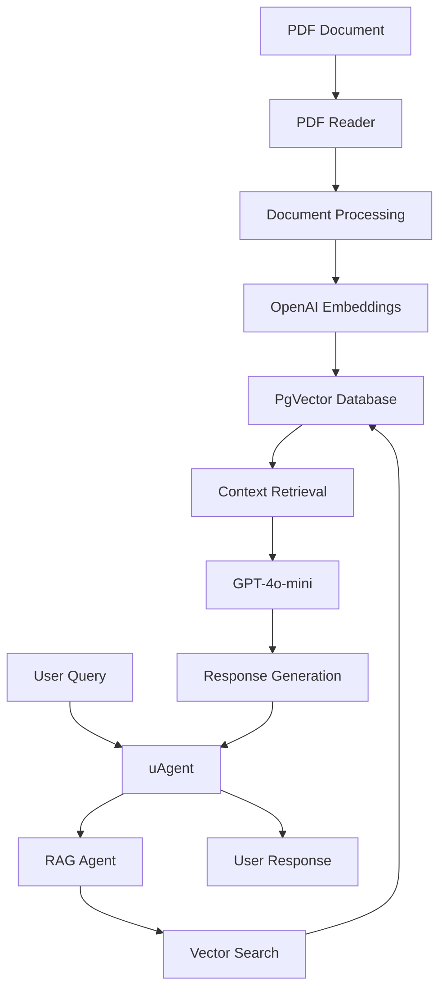

# 🤖 RAG Chat Agent with uAgent Integration

A sophisticated **Retrieval-Augmented Generation (RAG)** chat agent that combines the power of Agno RAG with uAgent's distributed agent protocol. This system processes PDF documents, creates intelligent embeddings, and provides context-aware responses through a robust chat interface.

## ✨ Features

- 🧠 **Advanced RAG System**: Leverages OpenAI's GPT-4o-mini with retrieval-augmented generation
- 📄 **PDF Document Processing**: Automatically processes and embeds PDF content into vector storage
- 🔍 **Hybrid Search**: Combines semantic and keyword search for superior accuracy
- 💬 **uAgent Chat Protocol**: Implements robust agent-to-agent communication
- 🗄️ **PgVector Storage**: Uses PostgreSQL with pgvector extension for efficient similarity search
- 🔄 **Real-time Processing**: Handles incoming messages with intelligent context retrieval
- 📊 **Comprehensive Logging**: Detailed logging for monitoring and debugging

## 🏗️ Architecture



## 🚀 Quick Start

### Prerequisites

- **Python 3.8+**
- **Docker & Docker Compose**
- **OpenAI API Key**
- **PostgreSQL with pgvector** (handled by Docker)

### 1. Clone and Setup

```bash
git clone <your-repo-url>
cd rag
```

### 2. Environment Configuration

Create a `.env` file in the project root:

```bash
# OpenAI Configuration
OPENAI_API_KEY=your_openai_api_key_here
```

### 3. Install Dependencies

```bash
pip install -r requirements.txt
```

### 4. Start the Database

```bash
docker-compose up -d
```

This will start a PostgreSQL instance with pgvector extension on port `5532`.

### 5. Prepare Your Document

Place your PDF file named `ai.pdf` in the project root directory.

### 6. Run the Agent

```bash
export OPENAI_API_KEY=your_actual_openai_api_key_here
python agent.py
```

## 📋 Detailed Setup

### Database Configuration

The system uses the following database settings:
- **Host**: `localhost:5532`
- **Database**: `ai`
- **User**: `ai`
- **Password**: `ai`
- **Table**: `ai_documents`

### Model Configuration

- **Embedding Model**: `text-embedding-3-small`
- **Chat Model**: `gpt-4o-mini`
- **Search Type**: Hybrid (semantic + keyword)
- **Port**: `8001`

## 🔧 Usage

### Starting the Agent

```bash
# Set your OpenAI API key
export OPENAI_API_KEY=sk-proj-your-key-here

# Run the agent
python agent.py
```

The agent will:
1. ✅ Initialize the knowledge base
2. 📖 Process the PDF document (`ai.pdf`)
3. 🔄 Generate embeddings for all document chunks
4. 💾 Store embeddings in the PgVector database
5. 🌐 Start the uAgent server on port `8001`
6. 👂 Listen for incoming chat messages

### Expected Output

```
INFO Loading knowledge base
INFO Reading: ai
INFO Loading knowledge base
INFO:httpx:HTTP Request: POST https://api.openai.com/v1/embeddings "HTTP/1.1 200 OK"
INFO Successfully loaded 79 documents from ai.pdf to knowledge base
INFO Knowledge base verification: Found 3 documents for test query
INFO Starting RAG Chat Agent...
INFO Agent address: agent1qvvtjgyccdtcjx49k5nhe0ngszry9gjv0289zrcrxcz8tngkc8ztju8u8a5
INFO Agent inspector available at https://agentverse.ai/inspect/?uri=http%3A//127.0.0.1%3A8001&address=agent1qvvtjgyccdtcjx49k5nhe0ngszry9gjv0289zrcrxcz8tngkc8ztju8u8a5
INFO Starting server on http://0.0.0.0:8001 (Press CTRL+C to quit)
```

## 🧪 Testing

### Test the RAG Functionality

```bash
# Test the knowledge base and RAG responses
python -c "
from agent import RAGChatAgent
import asyncio

async def test():
    agent = RAGChatAgent()
    response = await agent.generate_rag_response('What is artificial intelligence?')
    print('Response:', response)

asyncio.run(test())
"
```

### Verify Database Connection

```bash
# Check if the database is running
docker ps | grep pgvector

# Test database connection
python -c "
from agno.vectordb.pgvector import PgVector
db = PgVector(table_name='ai_documents', db_url='postgresql+psycopg://ai:ai@localhost:5532/ai')
print('Database connection successful!')
"
```

## 🔍 API Reference

### RAGChatAgent Class

#### Methods

- `__init__()`: Initialize the RAG chat agent with knowledge base and models
- `generate_rag_response(query: str)`: Generate a RAG-powered response for a given query
- `run()`: Start the uAgent server and begin listening for messages

#### Properties

- `knowledge`: AgentKnowledge instance managing the vector database
- `rag_agent`: AgnoAgent instance for RAG processing
- `uagent`: uAgent instance for chat protocol handling

### Chat Protocol

The agent implements the uAgent chat protocol with the following message types:

- `ChatMessage`: Incoming user messages
- `ChatAcknowledgement`: Message acknowledgements
- `TextContent`: Text content within messages

## 🛠️ Development

### Adding New Documents

To add new documents to the knowledge base, modify the document loading section in `RAGChatAgent.__init__()`:

```python
# Add multiple documents
pdf_reader = PDFReader()
documents = pdf_reader.read("path/to/your/document.pdf")

# Process and load documents
for i, document in enumerate(documents):
    document.id = f"doc_{i+1}_{uuid.uuid4().hex[:8]}"
    document.name = f"document_{i+1}"
    document.meta_data = {'source': 'your_document.pdf', 'page': i+1}

self.knowledge.load_documents(documents, upsert=True)
```

### Customizing Models

To use different OpenAI models:

```python
# For embeddings
embedder=OpenAIEmbedder(
    id="text-embedding-3-large",  # Change embedding model
    api_key=os.getenv("OPENAI_API_KEY")
)

# For chat completion
model=OpenAIChat(
    id="gpt-4",  # Change chat model
    api_key=os.getenv("OPENAI_API_KEY")
)
```

### Modifying Search Parameters

```python
# Adjust search parameters
search_results = self.knowledge.search(
    query, 
    num_documents=5,  # Number of documents to retrieve
    # Additional parameters can be added here
)
```

## 🐛 Troubleshooting

### Common Issues

#### 1. Database Connection Error
```
ERROR: Could not connect to database
```
**Solution**: Ensure PostgreSQL is running:
```bash
docker-compose up -d
docker ps | grep pgvector
```

#### 2. OpenAI API Error
```
ERROR: The api_key client option must be set
```
**Solution**: Set your OpenAI API key:
```bash
export OPENAI_API_KEY=your_actual_api_key_here
```

#### 3. PDF Processing Error
```
ERROR: Failed to read PDF
```
**Solution**: Ensure `ai.pdf` exists in the project directory:
```bash
ls -la ai.pdf
```

#### 4. Port Conflict
```
ERROR: Port 8001 already in use
```
**Solution**: Change the port in the agent configuration:
```python
self.uagent = Agent(
    name="RAG-Chat-Agent",
    seed="rag-chat-agent-seed",
    port=8002,  # Change port here
    mailbox=True,
)
```

### Debugging

Enable debug logging:

```python
import logging
logging.basicConfig(level=logging.DEBUG)
```

Check agent status:
```bash
# Check if agent is running
ps aux | grep python

# Check database status
docker logs rag-pgvector
```

## 📊 Performance

### Benchmarks

- **Document Processing**: ~79 documents processed in ~30 seconds
- **Embedding Generation**: ~1-2 seconds per document chunk
- **Query Response**: ~2-5 seconds for RAG responses
- **Memory Usage**: ~150MB for typical PDF documents

### Optimization Tips

1. **Batch Processing**: Documents are processed in batches for efficiency
2. **Caching**: Embeddings are cached in the database
3. **Hybrid Search**: Combines multiple search strategies for better results
4. **Connection Pooling**: Database connections are optimized for performance

## 🔒 Security

### API Key Management

- Store API keys in environment variables
- Never commit API keys to version control
- Use `.env` files for local development
- Consider using secret management services for production

### Database Security

- Use strong passwords for database access
- Limit database access to necessary IPs
- Enable SSL/TLS for production deployments
- Regular security updates for dependencies

## 📈 Monitoring

### Logs

The agent provides comprehensive logging:

- **INFO**: General operation status
- **WARNING**: Non-critical issues
- **ERROR**: Critical errors requiring attention
- **DEBUG**: Detailed debugging information

### Health Checks

Monitor the following:
- Database connectivity
- OpenAI API status
- Agent server status
- Document processing success rate

## 🤝 Contributing

1. Fork the repository
2. Create a feature branch (`git checkout -b feature/amazing-feature`)
3. Commit your changes (`git commit -m 'Add amazing feature'`)
4. Push to the branch (`git push origin feature/amazing-feature`)
5. Open a Pull Request

## 📄 License

This project is licensed under the MIT License - see the [LICENSE](LICENSE) file for details.

## 🙏 Acknowledgments

- [Agno](https://github.com/agno-agi/agno) - RAG framework
- [uAgent](https://github.com/fetchai/uagents) - Agent protocol

---