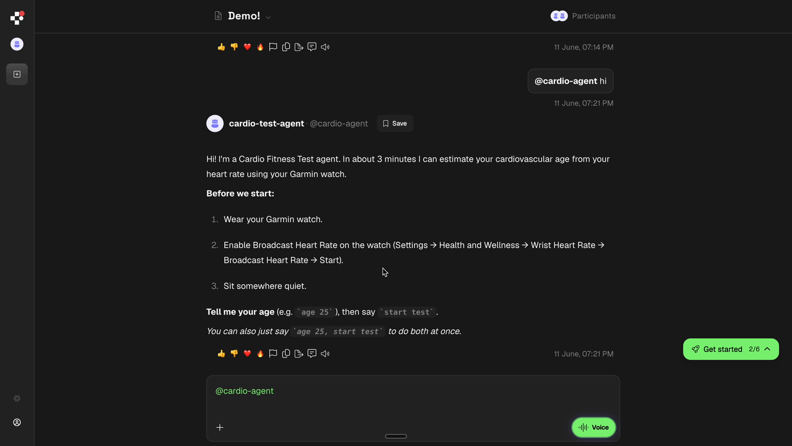

# CardioPulse

A live cardiovascular fitness-test agent for Agentverse and ASI:One.

From a chat message, the agent reads your live heart rate from a Garmin watch
over Bluetooth, walks you through a short three-phase test, and returns an
estimated **Cardio Fitness Age** with reference ranges, an inline chart, and a
plain-language summary. Repeated runs build a per-user trend.

> **Scope / disclaimer:** This is a proof of concept for a *live, stream-driven
> agent* — one that ingests a real-time sensor feed, reasons on it, and acts,
> all inside a chat. It is **not a medical device and not health advice.** The
> readings are illustrative estimates (roughly ±5 years); the trend across
> repeated tests matters far more than any single number.

## Overview

- **Category:** Live data, BLE, agent-to-agent
- **Tech stack:** Python, uAgents, Bleak (BLE), ASI:One Agent Chat Protocol, ASI-1, matplotlib
- **Status:** demo

## Features

- Ingests a live 1 Hz heart-rate stream from a Garmin watch over standard BLE.
- Runs a timed three-phase autonomic protocol (resting baseline → orthostatic →
  paced breathing) entirely through a chat conversation.
- Returns a structured result with reference ranges, an inline HR-timeline chart,
  and an ASI-1 natural-language coaching summary.
- Persists results per user and renders a trend chart across repeated tests.
- Two-agent architecture: a local BLE bridge agent + a mailbox-registered main
  agent reachable through ASI:One.

## Prerequisites

- **Python 3.12** (uAgents is incompatible with Python 3.14's asyncio changes)
- A **Garmin watch** with "Broadcast Heart Rate" (Forerunner, Fenix, Venu, …),
  or any standard BLE heart-rate strap (e.g. Polar H10)
- An [Agentverse](https://agentverse.ai) account
- *(Optional)* an [ASI:One](https://asi1.ai) API key for the AI coaching summary

## Installation

```bash
git clone <your-fork-url>
cd contributors/cardiopulse-agent
python3.12 -m venv .venv
source .venv/bin/activate
pip install -r requirements.txt
```

## Environment Variables

```bash
cp .env.example .env
```

| Variable | Required | Purpose |
|---|---|---|
| `AGENT_SEED` | yes | Seed that generates the main agent's address |
| `BRIDGE_SEED` | yes | Seed for the bridge agent (use a different value) |
| `GARMIN_NAME` | yes | Substring matched when scanning for the watch over BLE |
| `ASI1_API_KEY` | optional | Enables the AI coaching summary (static fallback otherwise) |
| `AGENT_URL` | optional | Where the bridge POSTs readings (default `http://127.0.0.1:8001/bpm`) |
| `IMGUR_CLIENT_ID` | optional | Fallback image host; charts use catbox.moe by default |

## Run the Agent

Start the main agent first so its REST endpoint is up before the bridge POSTs to
it. Both run on the same machine.

```bash
# 1. Main agent (chat protocol + local /bpm endpoint)
python agent.py

# 2. On the watch: enable Broadcast Heart Rate and keep that screen active.

# 3. Bridge agent (BLE -> POST to the main agent), in a second terminal
python bridge_agent.py
```

Then chat with the agent via ASI:One (or the Agentverse Manual Test panel):

```
age 25, start test
```

> For a clean, deterministic session, use the **Manual Test** panel on the
> agent's Agentverse profile rather than the main ASI:One chat.

## Expected Output

```
User: age 27, start test
Agent: Got it — age 27. Starting the test now.
Agent: Connected. Latest BPM: 64.
       Phase 1 — Resting baseline (2 minutes) ...
       (3 minutes later)
       Cardio Fitness Test — Results
       Cardio Fitness Age: 24 (you are 27)
       Resting HR: 58 bpm — a well-rested value for your age is typically under 65 bpm.
       ...
       [inline HR-timeline chart]
       Coach's read: ...
       [trend chart, from the second test onward]
```

Commands the agent understands: `help`, `age N`, `start test`
(`age N, start test` does both), `status`.

## Demo



## Agent Profile

Deployed on Agentverse via mailbox (the address is derived from your
`AGENT_SEED`). See [agentverse.ai](https://agentverse.ai).

## Architecture

```
[ Garmin Forerunner ]
        │  BLE — standard Heart Rate Service
        ▼
[ bridge_agent.py ]  ── HTTP POST (localhost:8001/bpm) ──►  [ agent.py — CardioPulse ]
   local uAgent                                                 uAgent: REST + mailbox
                                                                       │
                                                               Agent Chat Protocol
                                                               (Agentverse mailbox)
                                                                       ▼
                                                                [ ASI:One chat ]
```

- **Bridge agent** (`bridge_agent.py`) subscribes to the watch's BLE Heart Rate
  Measurement characteristic via Bleak and POSTs each reading to the main
  agent's local REST endpoint, reconnecting on its own if the watch drops.
- **Main agent** (`agent.py`) receives the stream on a local `/bpm` endpoint and
  is registered on Agentverse via mailbox for the ASI:One chat. Both agents run
  on the same machine, so the localhost POST keeps up with the 1 Hz stream —
  agent-to-agent mailbox routing is too slow for that rate, which is why HR data
  uses REST while the conversation uses the mailbox.
- Readings accumulate in a thread-safe in-memory ring buffer (`session_state`).
  The chat handler runs the test as a sequential coroutine and samples HR
  windows from that buffer at each phase boundary — the telemetry stream
  populates state but does not drive control flow.

## Verifying scoring without a watch

```bash
python test_scoring.py
```

Generates synthetic HR data for several hypothetical users and runs the scoring
engine end to end — useful for sanity-checking formula changes. Use
`python diagnose_ble.py` to confirm the watch is visible over BLE.

## Troubleshooting

- **"I'm not receiving any heart rate data"** — the watch isn't broadcasting.
  Enable Broadcast Heart Rate and keep that screen awake (tap occasionally).
- **Bridge can't find the watch** — make sure `GARMIN_NAME` matches what the
  watch advertises, and grant the terminal/Python Bluetooth permission
  (macOS: System Settings → Privacy & Security → Bluetooth).
- **`RuntimeError: no running event loop` on startup** — you're on Python 3.14;
  recreate the venv with Python 3.12.
- **Agent not reachable on ASI:One** — confirm the agent process is running and
  its mailbox is connected; the mailbox only exists while the agent is up.

## License

Apache-2.0 (repository default).
