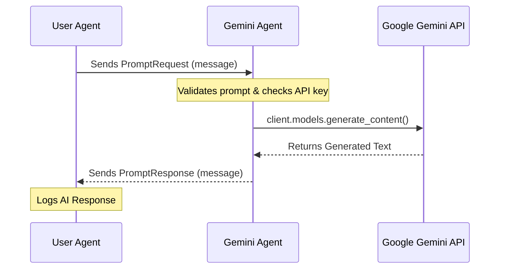

# Gemini AI Assistant Example

This example demonstrates how to integrate Google's Generative AI (Gemini) with the Fetch.ai `uagents` framework. It consists of a multi-agent system where a **User Agent** interacts with a **Gemini Agent** to receive AI-generated responses based on given prompts.

## Architecture & Message Flow

The system uses asynchronous messaging via the `uagents` protocol:



## Prerequisites

- Python 3.10 or higher
- A Google Gemini API Key. You can get one from [Google AI Studio](https://aistudio.google.com/).

## Installation

1. Navigate to the example directory:
   ```bash
   cd innovation-lab-examples/contributors/gemini_ai_assistant
   ```

2. (Optional) Create and activate a virtual environment:
   ```bash
   python -m venv venv
   # On Windows: venv\Scripts\activate
   # On Linux/macOS: source venv/bin/activate
   ```

3. Install the required dependencies:
   ```bash
   pip install -r requirements.txt
   ```

## Configuration

1. Rename the `.env.example` file to `.env`:
   ```bash
   # On Windows
   ren .env.example .env
   # On Linux/macOS
   mv .env.example .env
   ```

2. Open the `.env` file and add your Google Gemini API key:
   ```ini
   GEMINI_API_KEY=your_actual_api_key_here
   ```

## Running the Agents

To see the interaction, you will need to run the two agents in separate terminal windows.

### Terminal 1: Start the Gemini Agent

This agent will start up, load the API key, and listen for incoming prompts.

```bash
python gemini_agent.py
```

*Expected Output:*
```text
INFO:     [gemini_agent]: Starting Gemini Agent: gemini_agent
INFO:     [gemini_agent]: Agent address: agent1qdzh0lq802u3a8z7w9j83vntx23x7hmsuudflh2pwy005y5a5y4yv5f3rd6
INFO:     [gemini_agent]: Gemini client initialized successfully.
...
```

### Terminal 2: Start the User Agent

Once the Gemini Agent is running, start the User Agent. It will immediately send a `PromptRequest` to the Gemini Agent upon startup.

```bash
python user_agent.py
```

*Expected Output in Terminal 2:*
```text
INFO:     [user_agent]: Starting User Agent: user_agent
INFO:     [user_agent]: Sending prompt to Gemini Agent at agent1qdzh0lq802u3a8z7w9j83vntx23x7hmsuudflh2pwy005y5a5y4yv5f3rd6...
...
INFO:     [user_agent]: Received response from agent1qdzh0lq802u3a8z7w9j83vntx23x7hmsuudflh2pwy005y5a5y4yv5f3rd6:
INFO:     [user_agent]: AI Response: 
Decentralized AI agents are autonomous software programs that operate on distributed networks like blockchain, making decisions without a central authority. They interact with each other and their environment to solve complex problems or provide services in a secure and transparent manner.
```

*Expected Output in Terminal 1 (Gemini Agent):*
```text
INFO:     [gemini_agent]: Received prompt from agent1qv9cx...: 'Explain the concept of decentralized AI agents in two short sentences.'
INFO:     [gemini_agent]: Querying Gemini API...
INFO:     [gemini_agent]: Successfully generated response from Gemini.
```

## Error Handling

The example includes robust error handling for various failure states:
- **Missing API Key:** If the `GEMINI_API_KEY` is not set, the Gemini Agent will log a warning on startup and return an error response for any prompt it receives.
- **Empty Prompts:** Prompts that are empty or contain only whitespace will be rejected with a specific error message.
- **API/Network Failures:** If the call to Google's servers fails (e.g., due to network issues or an invalid key), the error is caught and safely communicated back to the User Agent inside the `PromptResponse`.

## Troubleshooting

### Common Errors and Fixes

- **Error:** `ModuleNotFoundError: No module named 'google.genai'`
  - **Fix:** Make sure you installed the dependencies with `pip install -r requirements.txt`.

- **Error:** `WARNING: GEMINI_API_KEY is not set in the environment variables.`
  - **Fix:** Ensure you have created the `.env` file and added your API key.

- **Error:** `Gemini client not initialized. Check API key.`
  - **Fix:** Provide a valid API key in the `.env` file and restart the `gemini_agent.py`.

- **Error from Gemini Agent:** `Gemini API Error: 400 API key not valid.`
  - **Fix:** Your API key is incorrect. Verify it from Google AI Studio.
