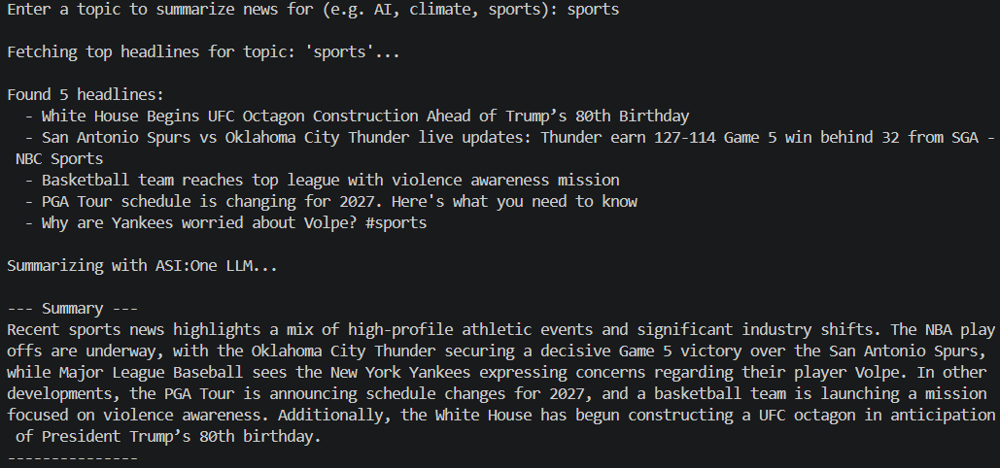

# News Summarizer Agent


A beginner-friendly Fetch.ai agent that fetches the top news headlines for any
topic using [NewsAPI](https://newsapi.org/) and summarizes them with the
[ASI:One](https://asi1.ai/) LLM. The agent speaks the
[Chat Protocol](https://innovationlab.fetch.ai/resources/docs/agent-communication/agent-chat-protocol),
so it can be messaged directly from ASI:One or any other Agentverse-connected
agent.

## What it does

1. You send a topic (e.g. "AI", "climate", "sports") as a chat message.
2. The agent fetches the top 5 latest headlines for that topic from NewsAPI.
3. The headlines are sent to ASI:One for a short summary.
4. The agent replies with the headlines plus a 3-4 sentence summary.

## Tech stack

| Layer | Technology |
|-------|------------|
| Agent runtime | [uAgents](https://docs.fetch.ai/agents/uaagents/) + Chat Protocol |
| News data | [NewsAPI](https://newsapi.org/) free tier |
| LLM | [ASI:One](https://asi1.ai/) (`asi1-mini`) |
| HTTP client | `requests` |
| Language | Python 3.10+ |

## Prerequisites

- Python 3.10+
- A free [NewsAPI](https://newsapi.org/register) key
- An [ASI:One](https://asi1.ai/) API key

## Setup

### 1. Navigate to this folder

```bash
cd contributors/news-summarizer-agent
```

### 2. Install dependencies

```bash
pip install -r requirements.txt
```

### 3. Set up environment variables

```bash
cp .env.example .env
```

Edit `.env` and fill in your API keys:

```env
ASI1_API_KEY=your_asi1_api_key_here
NEWS_API_KEY=your_news_api_key_here
```

### 4. Run the agent

```bash
python agent.py
```

The agent starts and prints its address. Send it a Chat Protocol message
containing a topic such as `AI`, `climate`, or `sports` and it will reply
with the latest headlines and a summary.

## Example interaction

```text
You:   sports
Agent: Top headlines for 'sports':
       - Headline 1...
       - Headline 2...

       Summary:
       <3-4 sentence summary generated by ASI:One>
```

## Demo



## Environment variables

| Variable | Required | Description |
|----------|----------|-------------|
| `ASI1_API_KEY` | Yes | Your ASI:One API key from [asi1.ai](https://asi1.ai/) |
| `NEWS_API_KEY` | Yes | Your NewsAPI key from [newsapi.org](https://newsapi.org/) |

## Project structure
