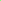

# RAG-powered Document Q&A Agent


A Retrieval-Augmented Generation (RAG) agent that ingests PDF or plain-text documents, chunks and embeds them using HuggingFace sentence-transformers, stores vectors in ChromaDB, and answers natural-language questions about the documents via the uAgents Chat Protocol — powered by Google Gemini 2.0 Flash.

- **Category:** `RAG`, `LLM`, `Integration`
- **Difficulty:** Intermediate

---

## What it does

1. You provide a document (PDF, .txt, .md, or .csv) via the `ingest` command or a `DOCUMENT_PATH` env var.
2. The document is split into chunks, embedded with `all-MiniLM-L6-v2`, and stored in a local ChromaDB vector store.
3. You ask questions via the Chat Protocol, and the agent retrieves relevant chunks and generates grounded answers using Gemini 2.0 Flash.
4. Answers are strictly based on document content — no hallucinated information.

---

## Tech stack

| Layer | Technology |
|-------|------------|
| Agent runtime | [uAgents](https://docs.fetch.ai/agents/uaagents/) + Chat Protocol |
| RAG framework | [LangChain](https://python.langchain.com/) |
| LLM | [Google Gemini 2.0 Flash](https://ai.google.dev/) (free tier) |
| Embeddings | [HuggingFace sentence-transformers](https://www.sbert.net/) (`all-MiniLM-L6-v2`) |
| Vector store | [ChromaDB](https://www.trychroma.com/) (local) |
| PDF parsing | [pypdf](https://pypdf.readthedocs.io/) |
| Language | Python 3.10+ |

**Flow:** User question → ChromaDB retrieval (top-4 chunks) → context injected into prompt → Gemini 2.0 Flash generates answer → plain-text reply.

---

## Prerequisites

- **Python 3.10+**
- **Google Gemini API key** — [Get one here](https://aistudio.google.com/apikey) (free tier available)

---

## Environment variables

| Variable | Required | Description |
|----------|----------|-------------|
| `GEMINI_API_KEY` | Yes | Google Gemini API key for LLM responses |
| `DOCUMENT_PATH` | No | Path to a document to auto-ingest on agent startup |
| `AGENTVERSE_API_KEY` | No | Agentverse key for mailbox deployment |

---

## Installation

```bash
# Navigate to this folder
cd contributors/rag-document-qa-agent

# Create a virtual environment
python -m venv .venv
source .venv/bin/activate    # Windows: .venv\Scripts\activate

# Install dependencies
pip install -r requirements.txt
```

---

## Setup

### 1. Set up environment variables

```bash
cp .env.example .env
```

Edit `.env` and fill in your API key:

```env
GEMINI_API_KEY=your_gemini_api_key_here
DOCUMENT_PATH=
```

### 2. (Optional) Pre-ingest a document

You can ingest a document before starting the agent:

```bash
python ingest.py path/to/your/document.pdf
```

Or set `DOCUMENT_PATH` in your `.env` to auto-ingest on startup.

---

## Run the Agent

```bash
python agent.py
```

The agent registers on Agentverse (if `AGENTVERSE_API_KEY` is set) or runs locally. Send it a Chat Protocol message to interact.

---

## Usage

Once the agent is running, interact via the Chat Protocol:

| Command | Description |
|---------|-------------|
| `ingest <path>` | Load a PDF or text document into the vector store |
| `status` | Check if a document is currently loaded |
| `<your question>` | Ask a question about the loaded document |

### Example interaction

```text
You:   ingest research-paper.pdf
Agent: Document ingested successfully!
       Chunks stored: 47
       You can now ask questions about the document.

You:   What is the main contribution of this paper?
Agent: Based on the document, the main contribution is a novel
       approach to retrieval-augmented generation that reduces
       hallucination rates by 40% compared to baseline methods...

You:   What methodology was used?
Agent: The paper uses a combination of quantitative evaluation
       on standard benchmarks and qualitative analysis of
       generated outputs...
```

---

## Project structure

```
contributors/rag-document-qa-agent/
├── agent.py              # uAgent with Chat Protocol
├── rag.py                # RAG pipeline (loading, chunking, embedding, QA)
├── ingest.py             # Standalone document ingestion script
├── requirements.txt      # Python dependencies
├── .env.example          # Environment variable template
├── assets/
│   └── demo.png          # Demo screenshot
└── README.md             # This file
```

---

## Architecture

```text
Document ──► pypdf / text loader
                │
                ▼
      RecursiveCharacterTextSplitter
                │
                ▼
      HuggingFaceEmbeddings (all-MiniLM-L6-v2)
                │
                ▼
           ChromaDB (local)
                │
                ▼
        Retriever (top-4 chunks)
                │
                ▼
     ChatPromptTemplate + Gemini 2.0 Flash
                │
                ▼
            Answer
```

---

## Troubleshooting

| Issue | Fix |
|-------|-----|
| `GEMINI_API_KEY is not set` | Add your Gemini API key to `.env` |
| `No document is loaded` | Run `ingest <path>` or set `DOCUMENT_PATH` in `.env` |
| `File not found` | Use an absolute path or path relative to the working directory |
| `ImportError: sentence_transformers` | Run `pip install sentence-transformers` |
| ChromaDB persistence errors | Delete the `chroma_db/` folder and re-ingest |

---

## Demo



## Agent Profile

[View Agent Profile](https://agentverse.ai/)

---

## License

Apache 2.0 (see repository root [LICENSE](../../LICENSE)).
