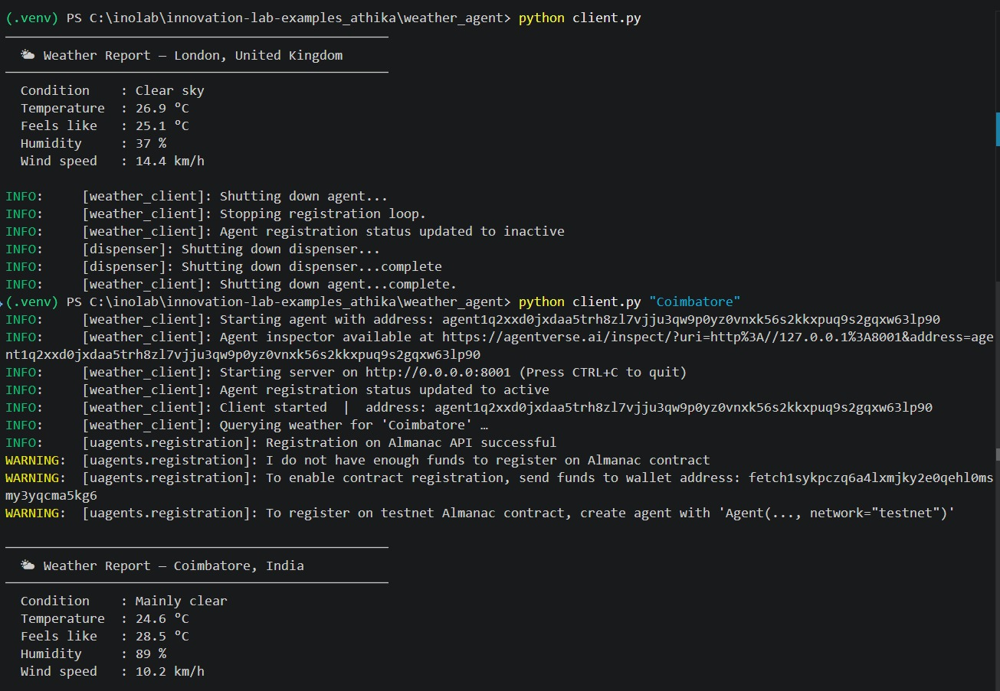
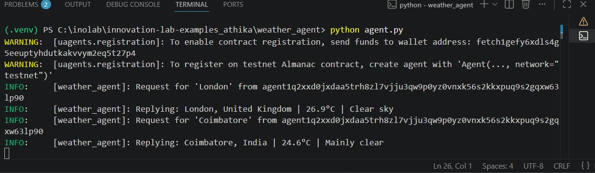

# weather-agent

> 🟢 **Beginner** · A uAgent that fetches real-time weather for any city using the free [Open-Meteo API](https://open-meteo.com/) — **no API key, no sign-up, zero cost**.

---

## 1) Project Title

`weather-agent`

A Fetch.ai uAgent that receives a city name and returns live weather conditions (temperature, humidity, wind speed, sky description) by querying the Open-Meteo REST API.

---

## 2) Overview

Most beginner agent examples either call a mocked API or require the user to sign up for a paid weather service. This example bridges that gap: it connects to a **real external API** the moment you run it, with **zero configuration**.

The agent listens for `WeatherRequest` messages, geocodes the city name via Open-Meteo's free Geocoding API, fetches current conditions, and replies with a structured `WeatherResponse` message.

- **Category:** `automation / real-world API`
- **Tech stack:** `Python · uAgents · Open-Meteo REST API · requests`
- **Difficulty:** 🟢 Beginner
- **Status:** `demo`

---

## 3) Features

- 🌍 Accepts **any city name** in the world (resolved via the Open-Meteo Geocoding API)
- 🌡️ Returns temperature, feels-like temperature, humidity, wind speed, and a WMO sky description
- 🔑 **No API key required** — completely free and open
- 🔁 Structured message passing with typed `Model` schemas shared between agent and client
- 🛡️ Graceful error handling for unknown cities or network failures

---

## 4) Prerequisites

| Requirement | Version |
|---|---|
| Python | ≥ 3.10 |
| pip | any recent version |
| Internet access | required (calls `open-meteo.com`) |

No API keys are needed.

---

## 5) Installation

```bash
git clone https://github.com/innovation-lab-examples.git
cd innovation-lab-examples/weather-agent

python -m venv .venv
source .venv/bin/activate        # Windows: .venv\Scripts\activate

pip install -r requirements.txt
```

---

## 6) Environment Variables

This agent works out of the box with no `.env` required. If you want to customise the agent's identity seed or prepare it for Agentverse, create a `.env` file:

```bash
cp .env.example .env
```

### Variables

| Variable | Required | Description |
|---|---|---|
| `AGENT_SEED` | ❌ Optional | Seed phrase that determines the agent's address. Defaults to a hardcoded string in `agent.py`. Change it to get a new address. |
| `CLIENT_SEED` | ❌ Optional | Seed phrase for the client agent. |
| `AGENTVERSE_API_KEY` | ❌ Optional | Only needed to publish on Agentverse. |

---

## 7) Run the Agent

### Step 1 — Start the weather agent

```bash
python agent.py
```

Expected output:

```
INFO:     [weather_agent]: Weather Agent started  |  address: agent1qfx0jmyn...
INFO:     [weather_agent]: Waiting for WeatherRequest messages …
```

> **Note the agent address** printed on startup — paste it into `client.py` as `WEATHER_AGENT_ADDRESS` if it differs from the default.

### Step 2 — Run the client (in a second terminal)

```bash
# Default city (London)
python client.py

# Or pass any city as an argument
python client.py "Tokyo"
python client.py "São Paulo"
python client.py "Coimbatore"
```

---

## 8) Expected Output

```
────────────────────────────────────────────────
  🌤  Weather Report — Tokyo, Japan
────────────────────────────────────────────────
  Condition    : Partly cloudy
  Temperature  : 22.4 °C
  Feels like   : 21.8 °C
  Humidity     : 63 %
  Wind speed   : 14.2 km/h
```

If the city is not found:

```
────────────────────────────────────────────────
  ⚠  Weather Agent Error
────────────────────────────────────────────────
  City 'Atlantis' not found. Please check the spelling.
```

---

## 9) Demo

> _Add a screenshot here after running the agent locally._

```


```

---

## 10) Agent Profile

Not yet published on Agentverse.  
Once published, link it here:

```
[View Agent Profile](https://agentverse.ai/agents/<address>)
```

---

## 11) Architecture

```
┌──────────────┐   WeatherRequest(city)    ┌──────────────────────┐
│  client.py   │ ────────────────────────► │     agent.py         │
│  (port 8001) │                           │     (port 8000)      │
│              │ ◄──────────────────────── │                      │
│              │   WeatherResponse(...)    │  1. Geocoding API    │
└──────────────┘                           │  2. Forecast API     │
                                           └──────────────────────┘
                                                      │
                                                      ▼
                                           https://open-meteo.com
                                           (free, no auth)
```

**Data flow:**

1. `client.py` sends a `WeatherRequest(city="Tokyo")` to the agent's address.
2. `agent.py` calls the Open-Meteo **Geocoding API** to resolve the city to `(lat, lon)`.
3. `agent.py` calls the Open-Meteo **Forecast API** with `current=` parameters for temperature, humidity, wind speed, and WMO weather code.
4. The agent maps the WMO code to a human-readable description and replies with a `WeatherResponse`.
5. `client.py` receives and pretty-prints the response, then exits.

---

## 12) Troubleshooting

| Symptom | Fix |
|---|---|
| `ModuleNotFoundError: uagents` | Run `pip install -r requirements.txt` inside your virtual environment. |
| Client prints nothing / times out | Make sure `agent.py` is running in another terminal **before** starting `client.py`. |
| `City not found` for a valid city | Try a more specific name (e.g. `"Mumbai"` instead of `"Bombay"`). |
| `ConnectionError` | Check your internet connection — both `geocoding-api.open-meteo.com` and `api.open-meteo.com` must be reachable. |
| Wrong agent address | Copy the address printed by `agent.py` on startup and paste it as `WEATHER_AGENT_ADDRESS` in `client.py`. |
| Port conflict (`8000` or `8001` already in use) | Change `port=` in `agent.py` / `client.py` and update the `endpoint=` URL to match. |

---

## 13) License

Apache 2.0 

---

