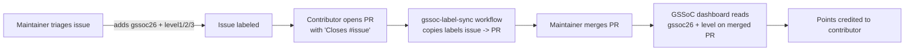

# GSSoC '26 — Labels & Contribution Tracking

This repository participates in **GirlScript Summer of Code 2026 (GSSoC '26)**.
The GSSoC dashboard awards points to contributors based on labels attached to
their **merged pull requests**. This document explains the label system we use
and how points are tracked automatically.

## How tracking works



1. A maintainer labels an **issue** with `gssoc26` and a level (`level1`,
   `level2`, or `level3`).
2. A contributor opens a PR that links the issue using a closing keyword
   (e.g. `Closes #123`, `Fixes #123`).
3. The [`gssoc-label-sync`](../.github/workflows/gssoc-label-sync.yml) workflow
   copies the safe GSSoC labels from the linked issue onto the PR.
4. When the PR is merged, the GSSoC dashboard reads `gssoc26` + the level label
   and credits points to the contributor.

> Important: link the issue in your PR description with `Closes #<number>` so
> the labels (and your points) sync automatically.

## Label set

All labels are defined in
[`.github/labels/gssoc-labels.json`](../.github/labels/gssoc-labels.json) and
created by the bootstrap workflow.

### Program

| Label | Meaning |
| --- | --- |
| `gssoc26` | Counts as a GSSoC '26 contribution |

### Level (points tiers read by the dashboard)

| Label | Tier | Typical scope |
| --- | --- | --- |
| `level1` | Lowest points | Beginner-friendly, small change |
| `level2` | Medium points | Intermediate feature/fix |
| `level3` | Highest points | Advanced / substantial work |

### Triage & bonus labels

| Group | Labels |
| --- | --- |
| Difficulty | `level:beginner`, `level:intermediate`, `level:advanced`, `level:critical` |
| Quality | `quality:clean`, `quality:exceptional` |
| Type bonus | `type:docs`, `type:testing`, `type:accessibility`, `type:performance`, `type:security`, `type:design`, `type:refactor`, `type:devops`, `type:bug`, `type:feature` |
| Validation | `gssoc:approved`, `gssoc:invalid`, `gssoc:spam`, `gssoc:ai-slop` |

## Creating the labels in the repo

Labels are created/updated automatically by the
[`gssoc-label-bootstrap`](../.github/workflows/gssoc-label-bootstrap.yml)
workflow:

- **Automatically** whenever `.github/labels/gssoc-labels.json` changes on
  `main`.
- **Manually** from the GitHub UI: *Actions → GSSoC Label Bootstrap → Run
  workflow*.

You can also run it locally with the GitHub CLI:

```bash
# requires: gh (authenticated with repo write access) + jq
bash .github/scripts/create-gssoc-labels.sh fetchai/innovation-lab-examples
```

The script is **idempotent** — it updates existing labels and never deletes
labels that are not in the JSON, so it is safe to re-run.

## For contributors (quick reference)

1. Pick an issue labeled `gssoc26` + a level.
2. Comment to get assigned (per `CONTRIBUTING.md`).
3. Open your PR with `Closes #<issue-number>` in the description.
4. The level/program labels sync to your PR automatically.
5. After merge, points appear on the GSSoC dashboard.
