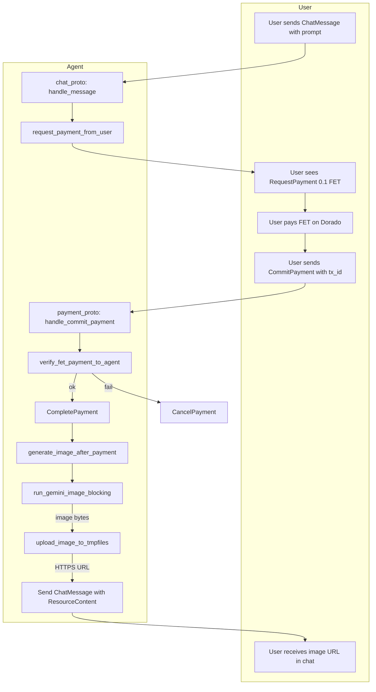
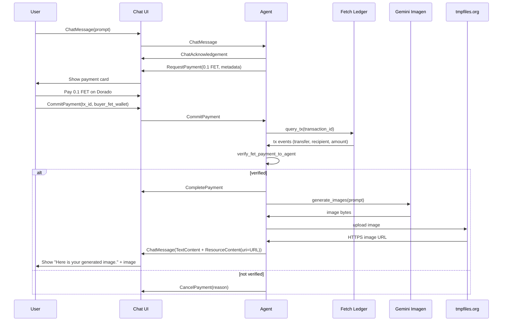

# Image Generation Agent 

A payment-ready agent that:

- Requests payment via the uAgents payment protocol
- Verifies and charges **0.1 FET** via direct FET on Dorado / Fetch network (seller flow)
- After successful payment, generates an image via **Gemini Imagen**
- Uploads to tmpfiles.org (HTTPS) and replies with a `ResourceContent` message (image URL)

## Protocols

This repo uses two uAgents protocols:

- **AgentChatProtocol**: Handles chat messages and acknowledgement.
- **Payment protocol** (`uagents_core.contrib.protocols.payment`): Seller-side payment.

Payment protocol models (from uagents-core):

- `Funds(amount, currency, payment_method)` – here: `amount="0.1"`, `currency="FET"`, `payment_method="fet_direct"`.
- `RequestPayment(accepted_funds, recipient, deadline_seconds, reference?, description?, metadata?)`.
- `CommitPayment(funds, recipient, transaction_id, metadata?)`.
- `RejectPayment`, `CancelPayment`, `CompletePayment`.

Rules (seller role):

- MUST implement handlers for `CommitPayment` and `RejectPayment`.
- Verification is on-chain: agent checks the Fetch/Dorado tx for transfer to its wallet.

## Payment Flow

1. User sends a chat message (the image prompt).
2. Agent immediately sends `RequestPayment` with:
   - `accepted_funds=[Funds(amount="0.1", currency="FET", payment_method="fet_direct")]`
   - `recipient=<agent wallet address>`
   - `metadata.provider_agent_wallet=<agent wallet address>`
   - `metadata.fet_network=stable-testnet` or `mainnet`
   - `metadata.content="Please complete the payment to generate this image."`
3. UI renders a FET payment card. User pays 0.1 FET on Dorado to the agent wallet.
4. User sends `CommitPayment` with `transaction_id` and `metadata.buyer_fet_wallet`.
5. Agent verifies the on-chain transfer via LedgerClient and sends `CompletePayment` on success.
6. Agent calls Gemini Imagen with the stored prompt, uploads the image to tmpfiles.org (HTTPS), and replies with `ChatMessage` containing `TextContent` + `ResourceContent` (image URL).

## Workflow (Mermaid)





## Environment

Create a `.env` (you can add an `env.example` with the same keys and empty values):

```env
# Agent
AGENT_NAME=Fet Example Agent
AGENT_SEED_PHRASE=gemini-imagen-agent
AGENT_PORT=8000

# Gemini Imagen (required for image generation)
GEMINI_API_KEY=
GEMINI_IMAGEN_MODEL=imagen-4.0-fast-generate-001

# Fetch network
FET_USE_TESTNET=true
```

Important:

- Load `.env` before importing modules that read env vars. `agent.py` does:
  ```python
  from dotenv import load_dotenv
  load_dotenv()
  ```
- The UI uses `metadata.provider_agent_wallet` and `metadata.fet_network` to show the FET payment card and network.

## Run locally

```bash
python3 -m venv .venv && source .venv/bin/activate
pip install -r requirements.txt
python agent.py
```

Agent runs on the port set in `AGENT_PORT` (default 8000) with mailbox enabled.

## Project structure

```
fet-example/
  agent.py          # Agent setup, loads env early, includes chat + payment protocols
  chat_proto.py     # Chat protocol and message handling (prompt → request payment / post-payment → generate)
  payment.py        # Seller-side payment (request, verify FET on-chain, charge flow)
  client.py         # Gemini Imagen client + tmpfiles.org upload (HTTPS URLs)
  shared.py         # Shared helpers (e.g. create_text_chat)
  requirements.txt
  README.md
```

## Notes

- If you change payment model shapes or protocol name/version, the UI may not render the payment card. Keep the same `Funds` and `RequestPayment` / `CommitPayment` semantics.
- `accepted_funds` must include FET with `payment_method="fet_direct"`.
- Always send `metadata.provider_agent_wallet` (and optionally `metadata.fet_network`) so the UI can show where to send FET.
- Image URLs are forced to HTTPS (including tmpfiles.org) so HTTPS pages (e.g. staging.asi1.ai) do not hit mixed-content blocks.
- You can replace the payment method with another (e.g. Skyfire/USDC) by changing `payment_method`, verification logic, and metadata expected by the UI.

## Enabling FET payments on ASI1

- In ASI1, open **My account** (e.g. from settings in the bottom left).
- Use **Labs** and enable **Developer mode** if you use it.
- Go to **Manage payments** (e.g. under your AI / top right) and connect a wallet that supports FET on Dorado so you can pay the agent’s 0.1 FET requests.
