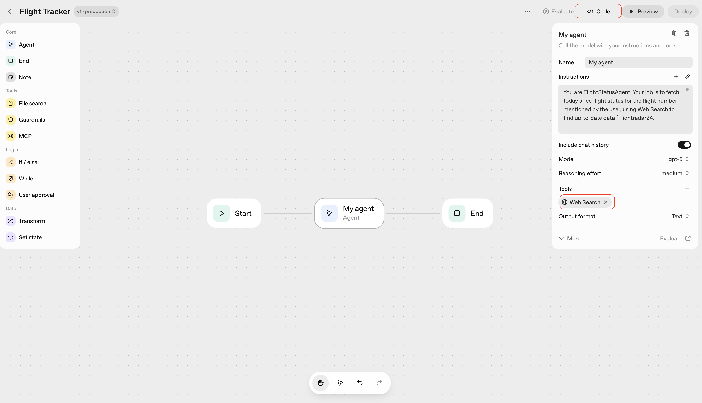
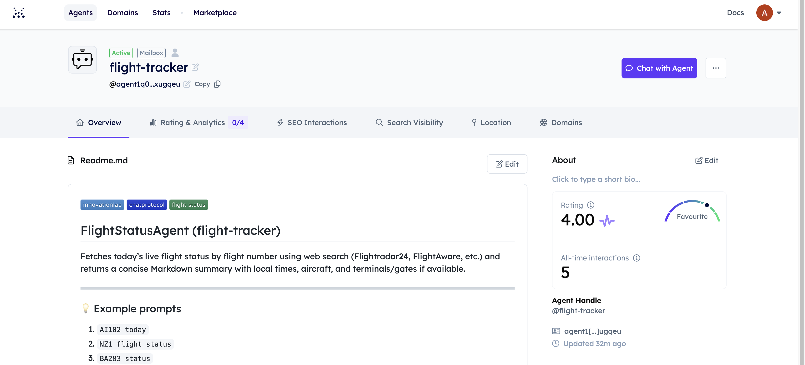
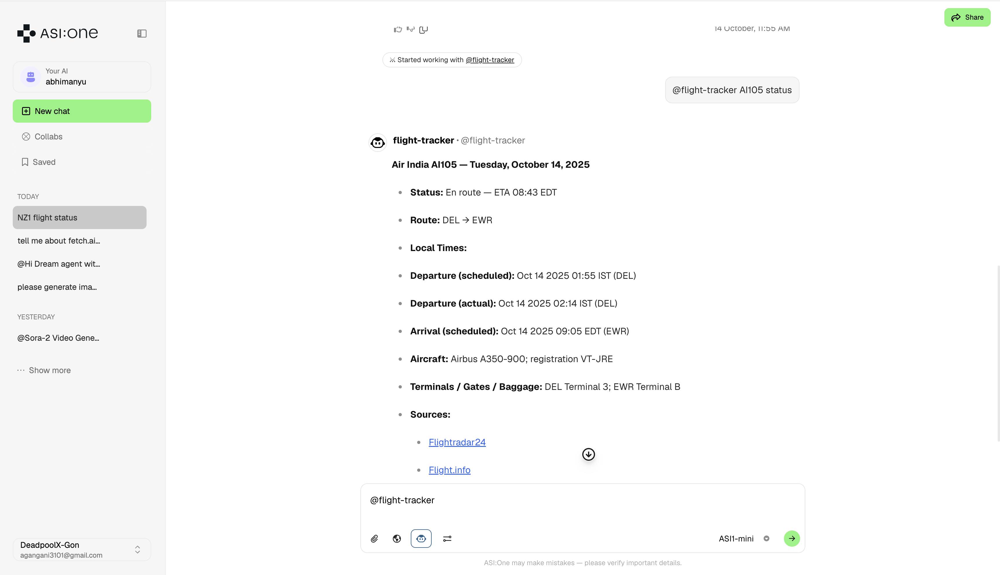

## 🛫 FlightStatusAgent (Flight Tracker)

Fetches live flight status (Flightradar24 / FlightAware / Flight.info) using OpenAI’s Agent SDK, then connects to uAgents and Agentverse so your flight tracker can be discovered and chatted with by ASI/ASI-One.

## 🧩 Overview

This repo demonstrates how to:

- Build an OpenAI Agent [via Agent Builder](https://platform.openai.com/agent-builder)
- Use the Agent SDK (Python) to define and run it programmatically
- Bridge it into the uAgent Protocol (so it works on ASI Agentverse)
- Publish the agent so it’s discoverable by ASI/ASI-One

## 🧠 Architecture

```
User → ASI / Agentverse → uAgent Bridge → OpenAI FlightStatusAgent → Web Search Tool (Flightradar24 / Flight.info)
```

## Core components:

- `workflow.py` — defines the OpenAI agent logic
- `uagent_bridge.py` — connects the agent to Agentverse using uagents
- `.env` — contains your OpenAI API key
- `requirements.txt` — pinned dependencies

### ⚙️ 1. Build the FlightStatusAgent on OpenAI

- Go to [Agent Builder](https://platform.openai.com/agent-builder)
- Create a new agent, name it Flight Tracker, and paste these instructions:

```
You are FlightStatusAgent. Your job is to fetch today’s live flight status for the flight number mentioned by the user, using Web Search to find up-to-date data (Flightradar24, FlightAware, Flight.info, etc.).

Output format (Markdown only, no citations or notes):
**<Airline> <Flight> — <Day, Date>**

- **Status:** <status>  
- **Route:** <Origin (IATA)> → <Destination (IATA)>  
- **Local Times:**  
  - **Departure (scheduled):** Oct 13 2025 20:55 EDT (JFK)  
  - **Departure (actual):** Oct 13 2025 23:16 EDT (JFK)  
  - **Arrival (scheduled):** Oct 15 2025 07:45 NZDT (AKL)  
  - **Arrival (actual):** <if available>  
- **Aircraft:** <model>; registration <reg>  
- **Terminals / Gates / Baggage:** <info if available>  
- **Sources:**  
  - [Flightradar24](https://www.flightradar24.com/data/flights/{flight_num})  
  - [Flight.info](https://www.flight.info/{flight_num}?utm_source=openai)

Rules:
- Never show citations or reference markers.  
- Use 3-letter timezone abbreviations (PST, EDT, NZDT).  
- Omit missing fields instead of guessing.  
- Always include Flightradar24 link.  
- Keep the output concise and visually clean.
```

- Add the Web Search Tool under Tools.
- Set model to gpt-5 and reasoning effort to medium.
- Save and deploy — the Agent Builder will give you a workflow ID.




### 🧰 2. Use the OpenAI Agent SDK

- Your workflow.py (see sample in this repo) defines:
- The agent’s code (Agent, WebSearchTool, ModelSettings)
-The async runner run_workflow() that wraps your agent execution

Run it locally:

```
python3 workflow.py
```

### 🔗 3. Bridge the Agent with uAgents

The file `uagent_bridge.py` registers your OpenAI agent as a uAgent:

- Responds to messages using the AgentChatProtocol
- Passes user flight queries to your OpenAI workflow
- Returns the markdown output to ASI clients

Run it locally

```
python3 uagent_bridge.py
```

You’ll see logs such as:

```
INFO: [FlightTracker]: Agent inspector available at https://agentverse.ai/inspect?...
INFO: [FlightTracker]: Mailbox client started
```

Use inspector link to connect agent to agentverse using mailbox.
That means it’s successfully published on the Agentverse network.




### 🌐 4. Add .env and requirements.txt

.env
```
OPENAI_API_KEY=your_openai_api_key_here
```

requirements.txt

```
openai
uagents
pydantic
python-dotenv
```

### 🧩 5. Example Interaction

On ASI.One or any connected LLM:

`@flight-tracker NZ1 status`

