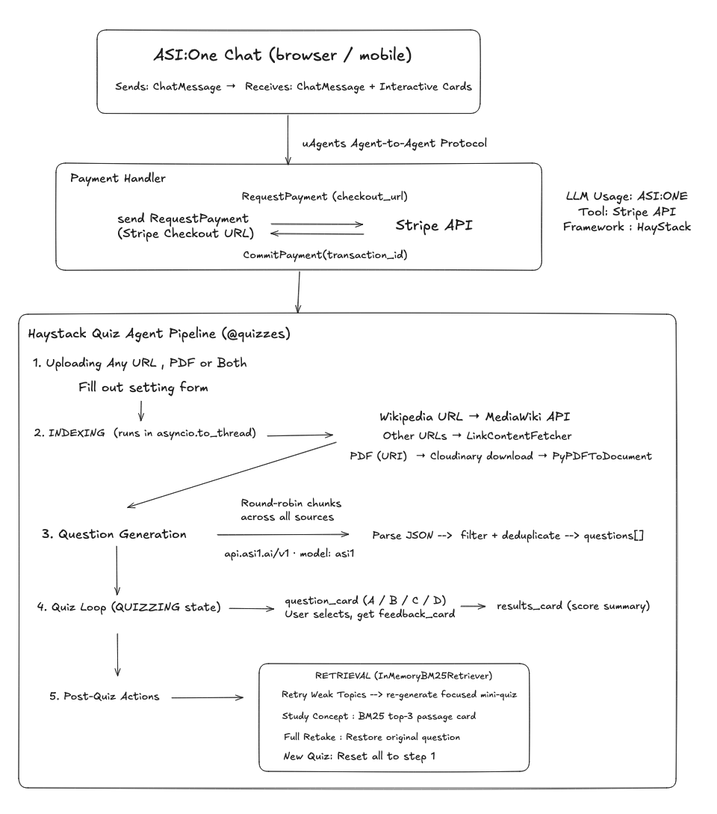

# Haystack Quiz Agent

An interactive, multi-source quiz generator that runs **entirely inside ASI:One Interactive Cards**. Built with the [Haystack](https://haystack.deepset.ai/) AI orchestration framework as a Fetch.ai Innovation Lab contribution.

> **Registered on Agentverse · Discoverable on ASI:One · Payment-gated via Stripe**

Find the agent on ASI:One — search for **`@quizzes`** or browse the [Agentverse profile](https://agentverse.ai/agents/details/agent1qtxql9e535wu5at6t96r3u2y327pjqmqf4zp89ye3c2x8eqdqj84yl8dfjm).

---

## Demo

[](https://youtu.be/RmrOGutIjbg)

> Click the thumbnail to watch the full walkthrough on YouTube — covers payment, source selection, live quiz, feedback cards, and retry flows.

---

## What it does

1. Pay a one-time **$2.00** fee via the Fetch Agent Payment Protocol (Stripe).
2. Choose your source type — a URL, a PDF, or both.
3. The agent indexes your material with a Haystack pipeline (fetch → clean → split → store).
4. Answer questions one at a time via interactive radio-button cards.
5. Every wrong answer shows a **grounded explanation** citing the exact source passage.
6. At the end: **Retry Weak Topics**, **Full Retake**, **Study Concept**, or **New Quiz**.

---

## What makes it different

| Feature               | This agent                                    | Typical quiz agent     |
| --------------------- | --------------------------------------------- | ---------------------- |
| Quiz delivery         | Native ASI:One Interactive Cards              | Downloads an HTML file |
| Wrong-answer feedback | Cites exact source text (Haystack RAG)        | Generic explanation    |
| Source ingestion      | URLs + PDFs, mixed in one session             | Single text input      |
| Retrieval             | BM25 — no OpenAI embedding key needed         | Usually none           |
| Payment               | Fetch protocol + Stripe, verified server-side | None                   |
| Resumable state       | Yes — survives browser close mid-quiz         | No                     |

---

## Architecture



```
User (ASI:One chat)
        │
        │  ChatMessage / Interactive Card selection
        ▼
┌──────────────────────────────────────────────────┐
│              Haystack Quiz Agent                 │
│              (uAgent, mailbox mode)              │
│                                                  │
│  ┌─────────────────────────────────────────────┐ │
│  │  Payment Protocol (Fetch / Stripe)          │ │
│  │                                             │ │
│  │  RequestPayment ──► Stripe Checkout Session │ │
│  │  CommitPayment  ──► Stripe API verify       │ │
│  │  CompletePayment ◄─ payment confirmed       │ │
│  └─────────────────────────────────────────────┘ │
│                                                  │
│  ┌─────────────────────────────────────────────┐ │
│  │  Haystack Pipelines                         │ │
│  │                                             │ │
│  │  Indexing                                   │ │
│  │    Wikipedia URLs ──► MediaWiki REST API    │ │
│  │    Other URLs ──► LinkContentFetcher        │ │
│  │               ──► HTMLToDocument            │ │
│  │    PDFs ──► Cloudinary download             │ │
│  │         ──► PyPDFToDocument                 │ │
│  │    All ──► DocumentCleaner                  │ │
│  │        ──► DocumentSplitter (5 sentences)   │ │
│  │        ──► InMemoryDocumentStore            │ │
│  │                                             │ │
│  │  Generation                                 │ │
│  │    ChatPromptBuilder                        │ │
│  │    ──► OpenAIChatGenerator (ASI:One LLM)    │ │
│  │                                             │ │
│  │  Retrieval (Study Concept / Retry Weak)     │ │
│  │   InMemoryBM25Retriever (no API key needed) │ │
│  └─────────────────────────────────────────────┘ │
└──────────────────────────────────────────────────┘
        │
        │  question_card ──► feedback_card ──► results_card
        ▼
User (ASI:One chat)
```

### Key design decisions

- **No OpenAI embeddings** — BM25 retrieval is used throughout. Zero additional API keys beyond ASI:One.
- **Wikipedia uses the MediaWiki REST API** — direct HTML scraping of Wikipedia returns 403. The API returns clean plain text and requires only a descriptive User-Agent.
- **PDFs arrive as Cloudinary markdown** — ASI:One encodes attached files as `` inside `TextContent`, not as a separate `ResourceContent` block. The agent parses this pattern directly.
- **Round-robin context window** — when multiple sources are indexed, chunks from each source are interleaved before hitting the 14,000-char LLM context cap, so no single source dominates.
- **State persists in `ctx.storage`** — a quiz survives agent restarts and browser closes. The in-memory Haystack document store is not persisted; after a restart, use "New Quiz" to rebuild the index.

---

## Prerequisites

| Requirement                      | Where to get it                                         |
| -------------------------------- | ------------------------------------------------------- |
| Python 3.11+                     | [python.org](https://python.org)                        |
| Agentverse account               | [agentverse.ai](https://agentverse.ai)                  |
| Agentverse API key               | Profile → API Keys                                      |
| ASI:One API key                  | [asi1.ai/dashboard](https://asi1.ai/dashboard/api-keys) |
| Stripe account (test mode)       | [dashboard.stripe.com](https://dashboard.stripe.com)    |
| Stripe secret + publishable keys | Stripe Dashboard → Developers → API keys                |

No OpenAI key is required.

---

## Setup

```bash
# 1. Clone the Innovation Lab repo and navigate to this agent
git clone https://github.com/fetchai/innovation-lab-examples.git
cd innovation-lab-examples/haystack-agents/quiz-agent

# 2. Create and activate a virtual environment
python -m venv .venv
source .venv/bin/activate          # Windows: .venv\Scripts\activate

# 3. Install dependencies
pip install -r requirements.txt

# 4. Configure environment variables
cp .env.example .env
#    Open .env and fill in every value (see Environment Variables below)

# 5. Run the agent
python agent.py
```

On startup the agent prints an Agentverse inspector link:

```
[agent] Inspector: https://agentverse.ai/inspect/?uri=http://127.0.0.1:8000&address=agent1q...
```

Open that link to connect the agent to your Agentverse mailbox. The agent will then appear as **Active** under `@quizzes` on ASI:One.

> **Note — Almanac contract registration**: On first run the agent registers on the Almanac API (off-chain) automatically. For full on-chain discoverability, send a small amount of FETCH to the wallet address printed in the startup logs, or use the [testnet faucet](https://faucet.fetch.ai/) during development.

---

## Environment Variables

Copy `.env.example` to `.env` and fill in:

| Variable                          | Required | Description                                                             |
| --------------------------------- | -------- | ----------------------------------------------------------------------- |
| `AGENTVERSE_API_KEY`              | Yes      | Agentverse API key for mailbox registration                             |
| `AGENT_SEED`                      | Yes      | Unique random string — determines the agent's permanent address         |
| `AGENT_NAME`                      | No       | Display name (default: `haystack-quiz-agent`)                           |
| `AGENT_PORT`                      | No       | Local port (default: `8000`)                                            |
| `ASI1_API_KEY`                    | Yes      | ASI:One API key — used by `OpenAIChatGenerator` for question generation |
| `ASI1_MODEL`                      | No       | Model name (default: `asi1`; use `asi1-mini` for lower cost)            |
| `STRIPE_SECRET_KEY`               | Yes      | Stripe secret key (`sk_test_...` for testing)                           |
| `STRIPE_PUBLISHABLE_KEY`          | Yes      | Stripe publishable key (`pk_test_...`)                                  |
| `STRIPE_AMOUNT_CENTS`             | No       | Price in cents (default: `200` = $2.00)                                 |
| `STRIPE_CURRENCY`                 | No       | Currency code (default: `usd`)                                          |
| `STRIPE_SUCCESS_URL`              | No       | Redirect after payment (default: `https://agentverse.ai`)               |
| `STRIPE_CHECKOUT_EXPIRES_SECONDS` | No       | Checkout TTL, 1800–86400 (default: `1800`)                              |

---

## User Flow

### 1. Payment

Every new chat session triggers a $2.00 Stripe Checkout. Use the Stripe test card:

```
Card number:  4242 4242 4242 4242
Expiry:       Any future date
CVC:          Any 3 digits
```

The agent verifies payment server-side via the Stripe API before unlocking quiz setup. Payment state persists — if the user closes and reopens the same chat, they do not pay again. A new chat window resets the session (by design, to prevent payment bypass).

### 2. Source Selection

After payment the agent shows a **Choose Your Source Type** router card:

| Option           | What happens                                                     |
| ---------------- | ---------------------------------------------------------------- |
| **I have a URL** | Form shown immediately — paste one or more URLs                  |
| **I have a PDF** | Agent prompts: "Attach your PDF and send any message"            |
| **I have both**  | Agent prompts: "Attach PDF and paste URL(s) in the same message" |

Supported URL types:

- Wikipedia articles (`en.wikipedia.org/wiki/...`) — fetched via MediaWiki API
- Any publicly accessible web page — fetched via browser-spoofed HTTP

Supported PDF sources:

- Files attached via ASI:One's "Add files" button (stored on Cloudinary, downloaded automatically)

### 3. Quiz Setup Form

| Field               | Options                                                 |
| ------------------- | ------------------------------------------------------- |
| Source URLs         | Optional when a PDF is already provided                 |
| Number of questions | 5 / 10 / 15 / 20                                        |
| Difficulty          | Easy (recall) / Medium (application) / Hard (synthesis) |
| Time limit          | Minutes; `0` = no limit                                 |

### 4. Quiz

- One question card at a time (A/B/C/D radio buttons)
- Immediate feedback card after each answer — cites the exact source
- Optional countdown timer shown on each question card

### 5. Results & Replay

| Action                | Behaviour                                                                  |
| --------------------- | -------------------------------------------------------------------------- |
| **Retry Weak Topics** | Generates a mini-quiz targeting only topics you got wrong (BM25 retrieval) |
| **Full Retake**       | Reshuffles the original questions and resets score                         |
| **Study Concept**     | BM25-retrieves the most relevant passage for your first weak topic         |
| **New Quiz**          | Resets all state; redirects to the source-type router                      |

---

## Tech Stack

| Layer                     | Technology                                                            |
| ------------------------- | --------------------------------------------------------------------- |
| Agent runtime             | `uagents==0.23.6` + `uagents-core==0.4.0`                             |
| Chat protocol             | `AgentChatProtocol v0.3.0`                                            |
| Payment protocol          | `AgentPaymentProtocol v0.1.0`                                         |
| AI orchestration          | `haystack-ai>=2.30.0`                                                 |
| LLM (question generation) | ASI:One `asi1` / `asi1-mini` via `api.asi1.ai/v1` (OpenAI-compatible) |
| Document retrieval        | `InMemoryBM25Retriever` (built into `haystack-ai` — no embedding API) |
| HTML ingestion            | `LinkContentFetcher` + `HTMLToDocument` + `trafilatura`               |
| PDF ingestion             | `PyPDFToDocument` + `pypdf`                                           |
| Wikipedia ingestion       | MediaWiki REST API (plain-text extracts, no scraping)                 |
| Payments                  | Fetch Agent Payment Protocol → Stripe embedded Checkout               |
| UI                        | ASI:One Interactive Cards (`form`, `detail`)                          |
| State persistence         | `ctx.storage` (JSON, per-sender)                                      |

---

## Project Structure

```
quiz-agent/
├── agent.py            # uAgent entry point — chat protocol, state machine
├── quiz_pipeline.py    # Haystack indexing, generation, and retrieval pipelines
├── quiz_cards.py       # ASI:One Interactive Card payload builders
├── session_manager.py  # ctx.storage wrappers; state constants
├── payment_handler.py  # Fetch payment protocol handler + Stripe integration
├── requirements.txt
├── .env.example
└── README.md
```

---

## Limitations

- **In-memory document store** — the Haystack index is not persisted to disk. After an agent restart, the payment and quiz state survive (they live in `ctx.storage`), but "Study Concept" and "Retry Weak Topics" require the source index from the current process. Trigger "New Quiz" to rebuild it.
- **PDF text layer required** — image-only (scanned) PDFs have no extractable text. The agent will warn and fall back to URL sources if available.
- **Single-language Wikipedia** — the Wikipedia API path targets `en.wikipedia.org`. Other language subdomains are not yet supported.
- **Context window cap** — total indexed content fed to the LLM is capped at ~14,000 characters per quiz session. Very long sources are truncated (proportionally across all sources).

---

## License

Apache 2.0 — see the root [`LICENSE`](../../LICENSE) of the Innovation Lab repository.
