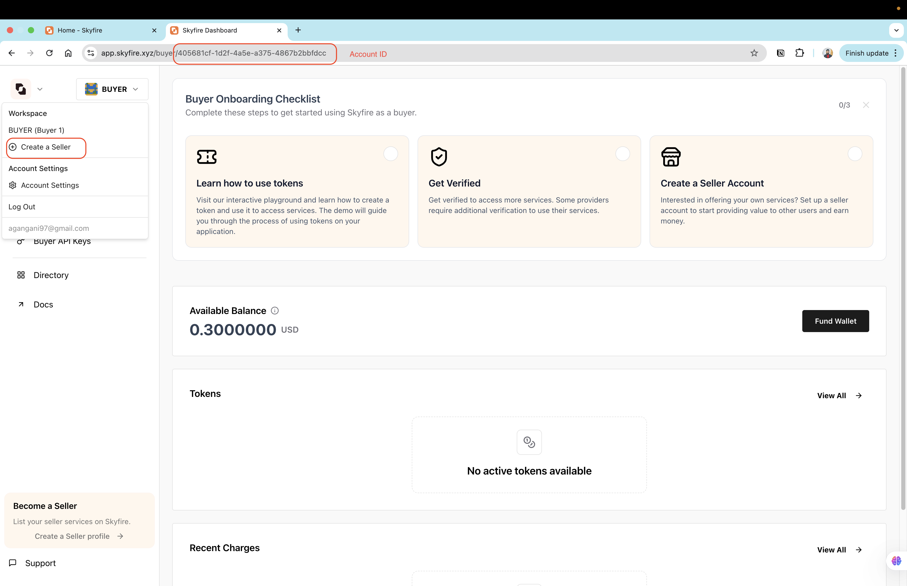
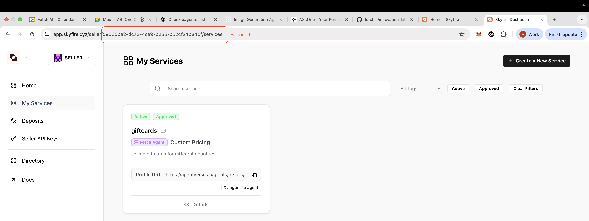
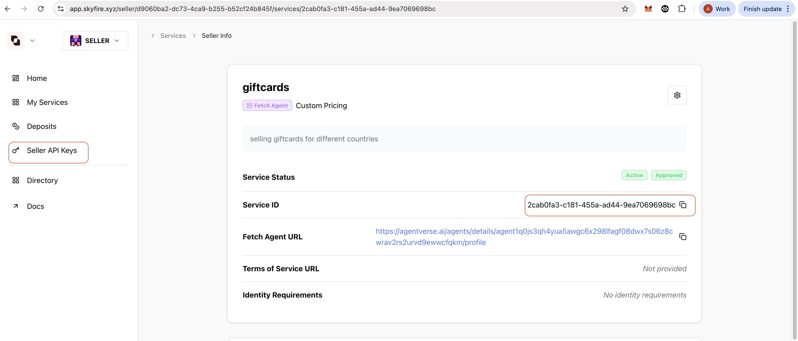

# Image Generation Agent (Skyfire + Pollinations + Agentverse)

A payment-ready agent that:
- Requests payment via the AgentPaymentProtocol
- Verifies and charges USDC $0.001 via Skyfire (seller/provider flow)
- After successful payment, generates an image via Pollinations
- Uploads to Agentverse External Storage and replies with a ResourceContent message

## Protocols

This repo includes two uAgents protocols:

- AgentChatProtocol: Handles chat messages and acknowledgement.
- AgentPaymentProtocol: Minimal payment protocol for agents.

Payment protocol models live locally in `protocol/payment.py` :
- `Funds(amount, currency, payment_method)` – default method set to `skyfire`.
- `RequestPayment(accepted_funds, recipient, deadline_seconds, reference?, description?, metadata?)`.
- `CommitPayment(funds, recipient, transaction_id, ...)`.
- `RejectPayment`, `CancelPayment`, `CompletePayment`.

Rules (seller role):
- MUST implement handlers for `CommitPayment` and `RejectPayment`.

## Payment Flow

1. User sends a chat message.
2. Agent immediately sends `RequestPayment` with:
   - `accepted_funds=[Funds(amount="0.001", currency="USDC", payment_method="skyfire")]`
   - `recipient=ctx.agent.address`
   - `metadata.skyfire_service_id=<your service UUID>`
   - `metadata.provider_agent_wallet=<agent wallet address>` (optional fallback/UI hint)
3. UI renders a Skyfire payment card. User commits payment (JWT token).
4. Agent verifies JWT claims and charges via Skyfire API.
5. On success, agent asks for the prompt, calls ASI1 generate, and returns image URL.

## Environment

Create a `.env` (copy from `env.example`):

```
# AgentVerse (optional)
AGENTVERSE_URL=https://agentverse.ai
AGENTVERSE_API_TOKEN=

# Skyfire (prod)
SKYFIRE_API_KEY=
SKYFIRE_SERVICE_ID=
SELLER_ACCOUNT_ID=
JWKS_URL=https://app.skyfire.xyz/.well-known/jwks.json
JWT_ISSUER=https://app.skyfire.xyz/
SKYFIRE_TOKENS_API_URL=https://api.skyfire.xyz/api/v1/tokens/charge

# (no extra API keys needed for Pollinations)
```

Important:
- Load `.env` before importing modules that read envs. `agent.py` does this:
  ```python
  import dotenv; dotenv.load_dotenv()
  ```
- The UI expects `metadata.skyfire_service_id` to be present for Skyfire cards to render.

## Run Locally

```bash
python3 -m venv .venv && source .venv/bin/activate
pip install -r requirements.txt
python3 agent.py
```
## Project Structure

```
asi1-image-agent/
  agent.py                # Agent setup, loads env early, includes chat & payment protocols
  chat_proto.py           # Chat protocol and message handling
  payment_proto.py        # Seller-side payment logic (request, verify, charge)
  protocol/payment.py     # Local payment protocol models & spec (AgentPaymentProtocol)
  skyfire.py              # JWT verification and charge (prod endpoints)
  requirements.txt
  env.example
  README.md
```

## Notes
- If you change the payment model shapes or protocol name/version, the UI may not render the payment card. Keep `AgentPaymentProtocol:0.1.0` and the fields above.
- `accepted_funds` should include USDC with `payment_method="skyfire"`.
- Always send `metadata.skyfire_service_id`.
- you can replace payment method with yours.

## Getting Skyfire tokens

- goto web [skyfire](https://skyfire.xyz/) and launch skyfire.
- login using your gmail.
- create an seller account and fill in your details.
- get your account-id from the url when you are into your seller.
- create a new service and get it approved.
-  get your details from below iamge.
 





## Enable skyfire on asi1

- enable developer mode in asi1 by going to My account in setting in bottom left.
- goto labs and enable dev mode.
- Now goto you AI at top right of UI and goto manage payments at the very bottom.
- Connect your skyfire account and you will have 0.3$ by default.
