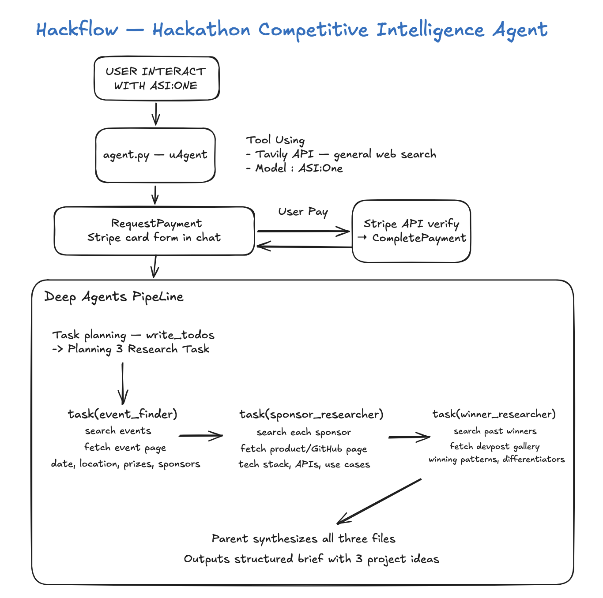

# Hackflow — Hackathon Competitive Intelligence Agent

> A production-grade autonomous agent that researches hackathons, maps sponsor
> tech stacks, identifies winning patterns, and delivers three tailored project
> ideas, all from a single message on ASI:One with Stripe payment integration.

**Demo:** [youtube.com/watch?v=hjBUYp_CoKU](https://youtu.be/hjBUYp_CoKU)  
**Requires Python 3.11+**

---

## Table of Contents

1. [What it demonstrates](#what-it-demonstrates)
2. [Architecture](#architecture)
3. [Quick start](#quick-start)
4. [Environment variables](#environment-variables)
5. [Using from ASI:One](#using-from-asione)
6. [LangChain Deep Agents](#langchain-deep-agents)
7. [Production guardrails](#production-guardrails)
8. [Troubleshooting](#troubleshooting)

---

## What it demonstrates

| Capability                            | Implementation                                                                                                    |
| ------------------------------------- | ----------------------------------------------------------------------------------------------------------------- |
| LangChain Deep Agents with sub-agents | `deepagents.create_deep_agent` + three registered sub-agents                                                      |
| Sub-agent task delegation             | `event_finder`, `sponsor_researcher`, `winner_researcher` write to virtual filesystem; parent synthesizes         |
| Virtual filesystem as shared memory   | `write_file` / `read_file` between sub-agents and parent                                                          |
| uAgents chat protocol                 | Invokable from ASI:One; handles `ChatMessage`, `ChatAcknowledgement`                                              |
| Stripe embedded checkout              | Card form rendered directly inside ASI:One chat via `RequestPayment` metadata                                     |
| ASI:One as primary LLM                | With automatic Claude fallback for resilience during rate limits                                                  |
| Production middleware                 | Retry, fallback, and call-limit guardrails on both parent and every sub-agent                                     |
| Per-session state isolation           | Each new ASI:One chat window starts fresh and requires its own payment                                            |
| Cross-turn memory                     | Brief + full conversation history in `ctx.storage`; follow-ups answered free via `HumanMessage`/`AIMessage` chain |

---

## Architecture



```
User (ASI:One chat window)
    │
    │  ChatMessage
    ▼
agent.py  ── uAgent: chat protocol + payment protocol
    │
    ├─ [Session check]  ctx.session changed? → reset all state (new session = new payment)
    │
    ├─ State A: _send_text()                     payment pitch (no free preview)
    │           └─ request_payment_from_user()   creates Stripe checkout session
    │                                            sends RequestPayment + metadata["stripe"]
    │                                            ASI:One renders embedded card form
    │
    ├─ [CommitPayment arrives]
    │           │  Stripe API verify payment_status == "paid"
    │           └─ CompletePayment + set hackflow:paid in ctx.storage
    │
    ├─ State C: _deliver_brief()  →  workflow.run_query()
    │               │
    │               ▼
    │          workflow.py  (create_deep_agent)
    │               ├── write_todos        plan 3 research tracks
    │               ├── task(event_finder)         → events.md
    │               ├── task(sponsor_researcher)   → sponsors.md
    │               ├── task(winner_researcher)    → winners.md
    │               ├── read_file × 3
    │               └── parent synthesizes → competitive brief + 3 project ideas
    │
    │           brief_complete? → store brief (State D) + deliver to user
    │           brief_partial?  → keep paid state, ask user to retry free
    │
    └─ State D: answer_followup()                free, direct LLM call
                Uses stored brief as context; no Deep Agents pipeline, no charge
                "new search" → clear all state → back to State A
```

### File layout

```
hackflow-agent/
├── agent.py        uAgent entry point; 4-state chat handler; session isolation
├── payments.py     Stripe checkout, CommitPayment handler, state key constants
├── workflow.py     create_deep_agent factory; run_query, answer_followup
├── tools.py        Search/fetch primitives (Tavily + httpx)
├── requirements.txt
├── .env.example
└── README.md
```

---

## Quick start

### Prerequisites

- Python 3.11 or 3.12 (deepagents does not support 3.10 or earlier)
- API keys for: ASI:One (or Anthropic), Agentverse, Tavily, Stripe

### Installation

```bash
# 1. Navigate to this directory
cd innovation-lab-examples/langchain-deepagents/hackflow-agent

# 2. Create isolated virtual environment — required, do not skip
python3.11 -m venv .venv
source .venv/bin/activate          # Windows: .venv\Scripts\activate

# 3. Install dependencies
pip install -r requirements.txt

# 4. Configure
cp .env.example .env
# Edit .env — see Environment variables section below
```

### Running

```bash
# Always activate venv first — deepagents is not installed globally
source .venv/bin/activate

python agent.py
```

Healthy startup output:

```
INFO: Starting agent with address: agent1q...
INFO: Starting mailbox client for https://agentverse.ai
INFO: Manifest published successfully: AgentPaymentProtocol
INFO: Manifest published successfully: AgentChatProtocol
INFO: Registration on Almanac API successful
```

> **Important:** Always run `python agent.py` from inside the activated `.venv`.
> Running with the system Python will start the agent (uagents may be installed
> globally) but `deepagents` and LangChain packages will be missing, causing
> `ModuleNotFoundError` on every paid query.

---

## Environment variables

Copy `.env.example` to `.env` and fill in the values below.

| Variable                 | Required    | Description                                                                                     |
| ------------------------ | ----------- | ----------------------------------------------------------------------------------------------- |
| `ASI1_API_KEY`           | Recommended | ASI:One API key — preferred LLM; get from [asi1.ai](https://asi1.ai) → Profile → API Keys       |
| `ANTHROPIC_API_KEY`      | Fallback    | Claude Haiku used automatically when ASI:One is rate-limited                                    |
| `AGENTVERSE_API_KEY`     | **Yes**     | From [agentverse.ai](https://agentverse.ai) → Settings → API Keys                               |
| `AGENT_SEED`             | **Yes**     | Any passphrase — deterministically generates the agent wallet address. Keep secret.             |
| `TAVILY_API_KEY`         | **Yes**     | Web search API; free tier at [tavily.com](https://tavily.com)                                   |
| `STRIPE_SECRET_KEY`      | **Yes**     | `sk_test_...` from [dashboard.stripe.com](https://dashboard.stripe.com) → Developers → API keys |
| `STRIPE_PUBLISHABLE_KEY` | **Yes**     | `pk_test_...` from the same Stripe dashboard page                                               |
| `STRIPE_AMOUNT_CENTS`    | No          | Integer cents. Default: `100` ($1.00)                                                           |
| `STRIPE_CURRENCY`        | No          | ISO 4217 code. Default: `usd`                                                                   |
| `STRIPE_SUCCESS_URL`     | No          | Redirect after checkout. Default: `https://agentverse.ai`                                       |
| `AGENT_NAME`             | No          | Agent display name. Default: `hackflow-competitive-intel`                                       |
| `AGENT_PORT`             | No          | Local HTTP port. Default: `8008`                                                                |

At minimum, one LLM key (`ASI1_API_KEY` **or** `ANTHROPIC_API_KEY`) must be set.
Both is strongly recommended for fallback resilience.

### Getting Stripe test keys

1. Create a free account at [dashboard.stripe.com](https://dashboard.stripe.com)
2. Go to **Developers → API keys**
3. Copy `Publishable key` (`pk_test_...`) and `Secret key` (`sk_test_...`)
4. Test card: `4242 4242 4242 4242`, any future expiry, any CVC, any postal code

---

## Using from ASI:One

1. Start the agent and confirm `Manifest published successfully` in the terminal
2. Go to [asi1.ai](https://asi1.ai)
3. Open a **New Chat**
4. Mention the agent: `@hackflow-competitive-intel`
5. Send a hackathon query, for example:
   > `@hackflow-competitive-intel Give me all the hackathon in SF from June 2026 to December 2026 `
6. The agent responds with a payment pitch and a **Stripe card form** appears inside the chat
7. Complete payment with a test card: `4242 4242 4242 4242`, any future expiry, any CVC
8. Wait 30–90 seconds while the agent runs three research tracks in parallel
9. Receive the full **competitive brief**:
   - Sponsor tech stack analysis
   - Past winner patterns
   - 3 tailored project ideas with architecture and win strategy

### Follow-up questions (free)

After receiving a brief, ask anything about the delivered content at no charge:

> `I will attending UC Berkeley AI Hackathon, can you give me event detail and top 3 winning project idea`
> `Give me full implementation steps for project idea 2`
> `What tech stack should I use to target the Fetch.ai sponsor prize?`

Type **`new search`** to clear the session and start a fresh paid query.

---

## LangChain Deep Agents

Uses [`deepagents`](https://github.com/langchain-ai/deepagents) — LangChain's
batteries-included agent harness built on LangGraph.

### Agent factory

```python
agent = create_deep_agent(
    model=primary_model,          # any LangChain chat model
    tools=[...],                  # dumb search/fetch primitives
    system_prompt=INSTRUCTIONS,
    subagents=[                   # TypedDicts — each gets own context window
        {**_EVENT_FINDER,      "model": primary, "middleware": sub_mw},
        {**_SPONSOR_RESEARCHER,"model": primary, "middleware": sub_mw},
        {**_WINNER_RESEARCHER, "model": primary, "middleware": sub_mw},
    ],
    middleware=parent_mw,
)
```

### Built-in tools used

| Tool                         | Purpose                                                                           |
| ---------------------------- | --------------------------------------------------------------------------------- |
| `write_todos`                | Agent plans all three research tracks before starting                             |
| `task(agent=..., input=...)` | Delegates to a named sub-agent with isolated context                              |
| `write_file` / `read_file`   | Sub-agents write `events.md`, `sponsors.md`, `winners.md`; parent reads all three |

### Why the `"model"` key matters for sub-agents

Without `"model"` in each sub-agent dict, `deepagents` only wires tool-call
middleware to sub-agents — leaving all model calls inside them unprotected. A
single ASI:One 429 inside `sponsor_researcher` would propagate uncaught and abort
the entire run even though the parent has a fallback. Adding `"model": primary`
ensures `ModelRetryMiddleware` and `ModelFallbackMiddleware` protect every LLM
call in every sub-agent.

### Memory model

Each `agent.invoke()` call is **completely stateless** — the virtual filesystem
(write_file/read_file) is in-memory and discarded after the call. For cross-turn
memory, the agent uses `ctx.storage` (SQLite on disk):

- Delivered brief → stored as `hackflow:brief:{sender}`
- Conversation history → each follow-up turn stored as `{"role", "content"}` dicts,
  reconstructed as `HumanMessage` / `AIMessage` objects so the model correctly
  resolves references across turns ("that idea", "the one you just described")
- Follow-up questions → `answer_followup()` makes a direct LLM call with the
  brief + full history; no Deep Agents pipeline, no sub-agents, no new payment

---

## Production guardrails

The middleware stack is applied to **both the parent agent and every sub-agent**.
Sub-agents run in isolated context windows, so each needs its own middleware chain.

```
Parent agent (run_query):
  ModelRetryMiddleware     max_retries=2, backoff 2 s → 30 s
  ModelFallbackMiddleware  → Claude Haiku if ASI:One keeps failing
  ModelCallLimitMiddleware run_limit=30
  ToolCallLimitMiddleware  run_limit=60
  ToolRetryMiddleware      retries fetch_event_detail on network errors

Each sub-agent (event_finder / sponsor_researcher / winner_researcher):
  Same stack with tighter per-call limits:
  ModelCallLimitMiddleware run_limit=12
  ToolCallLimitMiddleware  run_limit=20
```

## Troubleshooting

**`ModuleNotFoundError: No module named 'deepagents'`**

The agent was started with the system Python instead of the virtualenv.

```bash
source .venv/bin/activate   # must see (.venv) in your prompt
python agent.py
```

**`[Errno 48] address already in use`**

Another process is holding port 8008. Find and kill it:

```bash
lsof -i :8008 -t | xargs kill
python agent.py
```

**Agent says "Still waiting for your $1.00 payment" in a new chat**

Stale checkout state from a previous session is in `ctx.storage`. Say
`new search` in the chat to reset, or restart the agent (it will detect the
new session UUID on the first message and clear state automatically).

**Brief delivered but follow-up says "project ideas not in brief"**

This can happen if an old, event-only brief is stored from a previous session.
Say `new search` then start a fresh paid query. The completeness guard now
prevents partial briefs from being stored.

**ASI:One 429 errors filling the terminal**

Expected when the ASI:One free tier rate limit is hit during a multi-subagent
run. `ModelRetryMiddleware` handles automatic retries; `ModelFallbackMiddleware`
switches to Claude Haiku after 3 consecutive failures. Ensure `ANTHROPIC_API_KEY`
is set for maximum resilience.

---

## References

- [LangChain Deep Agents overview](https://docs.langchain.com/oss/python/deepagents/overview)
- [LangChain Deep Agents going to production (middleware)](https://docs.langchain.com/oss/python/deepagents/going-to-production)
- [LangChain Deep Agents sub-agents](https://docs.langchain.com/oss/python/deepagents/subagents)
- [LangChain Deep Agents models](https://docs.langchain.com/oss/python/deepagents/models)
- [uAgents documentation](https://docs.fetch.ai/uagents)
- [ASI:One](https://asi1.ai)
- [Agentverse](https://agentverse.ai)
- [Stripe Documentation](https://docs.stripe.com/get-started)
- [Tavily Search API](https://tavily.com)
- [Fetch.ai Innovation Lab Examples](https://github.com/fetchai/innovation-lab-examples)

---

## License

MIT — see [LICENSE](../../LICENSE) in the repository root.
