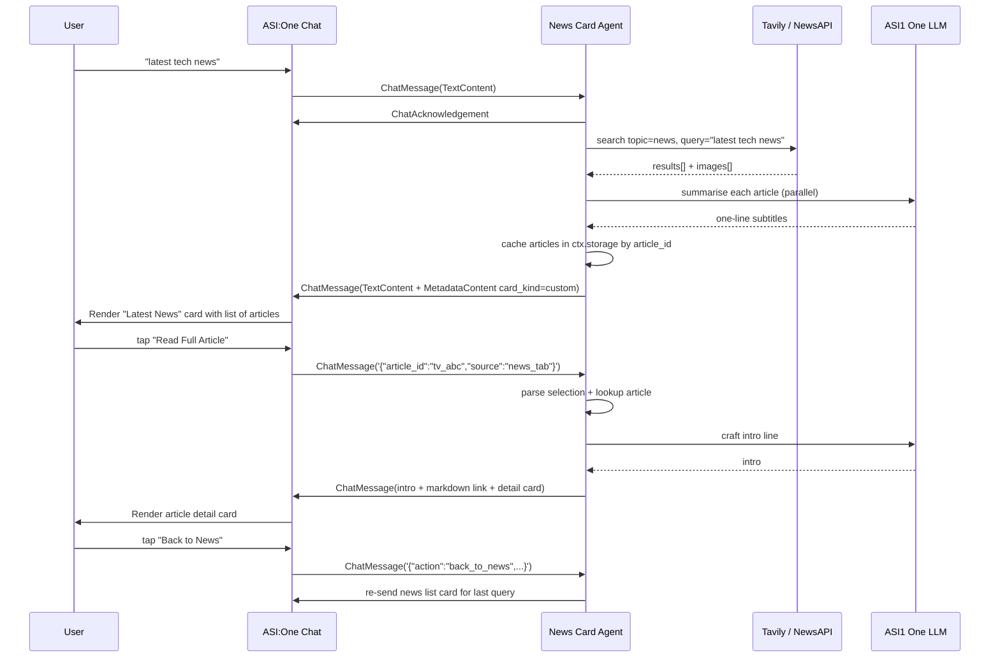

# News Card Agent

      

## 🎯 News Card Agent: A Rich, Interactive News Feed for ASI:One

Want to show news inside ASI:One that **looks like a real app**, not a wall of text? The News Card Agent is a uAgent that replies with **agent-driven interactive cards** — a scrollable list of articles with cover images, headlines, source badges, and a **Read Full Article** button on every item. Tap the button and a brand-new detail card slides in with the full article preview and a clickable link to the source.

It uses [Tavily](https://app.tavily.com/home) for live web-search news, [ASI1 One LLM](https://asi1.ai) to polish each article's subtitle into a single tight sentence, and the [Agentverse element-tree card primitives](https://docs.agentverse.ai/documentation/advanced-usages/element-tree-primitives) to render the UI. **No payment protocol** — pure chat + cards.

### What it Does

This agent takes any free-text news query (e.g. `latest tech news`, `bitcoin news`, `world news`) and replies with a rich card carousel. Each article in the card is selectable — tapping **Read Full Article** triggers a follow-up message back to the agent, which then renders a second card with the article's full body and source link.

## ✨ Key Features

* **Agent-Driven Interactive Cards** - Sends a `MetadataContent` block carrying `card_kind: "custom"` element trees (no plain-text walls)
* **News List Card** - `section` → `list` of items with image, heading, body text, source badge, and a primary "Read Full Article" button
* **Article Detail Card** - rendered on button click, with hero image, full description, source link, and a "Back to News" button
* **Tavily Web Search** - Default backend; live `topic: "news"` search across the web with auto-paired images
* **Multi-Backend** - Auto-cascades **Tavily → NewsAPI.org → Hacker News** based on which env keys are set; no key required to run
* **ASI1 LLM Polishing** - Each card subtitle is summarised to one sentence by ASI1 One LLM (with graceful fallback to raw API descriptions)
* **Selection Round-Trip** - Handles both inbound formats from the chat UI: raw JSON (direct @mention) and natural-language prose (via planner)
* **Storage-Backed Lookup** - Articles are cached in `ctx.storage` by `article_id` so the detail card can render even if the news API is rate-limited
* **No Payment Protocol** - Just the standard chat protocol + cards

## 🔧 Setup

### Prerequisites

- Python 3.10 or higher
- pip (Python package manager)
- [ASI1 One LLM](https://asi1.ai) API key (recommended — used for subtitle polish)
- [Tavily](https://app.tavily.com/home) API key (recommended — preferred news backend)
- _(Optional)_ [NewsAPI.org](https://newsapi.org) key — fallback if Tavily is not set

> If you skip every news key, the agent still works by falling back to the public Hacker News Firebase API (no key required).

### Installation

1. **Clone the repository:**
```bash
git clone <repository-url>
cd news-card-agent
```

2. **Install dependencies:**
```bash
pip install -r requirements.txt
```

3. **Configure environment variables:**

Create a `.env` file in the project root directory with the following variables:

```env
# Agent identity
AGENT_NAME=News Card Agent
AGENT_SEED_PHRASE=news-card-agent-seed
AGENT_PORT=8000

# ASI1 One LLM (used to polish card subtitles & intro lines)
ASI_ONE_API_KEY=your_asi1_api_key_here
ASI_ONE_MODEL=asi1-mini

# Tavily web-search API (preferred news backend)
TAVILY_API_KEY=tvly-dev-xxxxxxxxxxxxxxxxxxxxxx

# NewsAPI.org - used only if TAVILY_API_KEY is empty
NEWS_API_KEY=
# Country code for NewsAPI top-headlines, or "any" for no country filter
NEWS_API_COUNTRY=any
```

**How to get API keys:**
- **ASI1 One LLM**: Sign up at [ASI1.ai](https://asi1.ai)
- **Tavily**: Free dev key at [app.tavily.com/home](https://app.tavily.com/home)
- **NewsAPI.org**: Free dev key at [newsapi.org](https://newsapi.org)

### How to Start

Run the agent with:

```bash
python agent.py
```

The agent will start on the following port:
- **Agent mailbox**: `http://localhost:8000` (registered with Agentverse mailbox)

**To stop the application:** Press `CTRL+C` in the terminal

### Example Queries

```plaintext
latest news
```

```plaintext
latest tech news
```

```plaintext
world news today
```

```plaintext
bitcoin price news
```

```plaintext
SpaceX launch news
```

```plaintext
AI agents news
```

### Expected Response Format

When you ask for news, the agent replies with **two pieces in one ChatMessage**:

1. A `TextContent` preamble (one-line intro generated by ASI1 LLM):

```
Here are 6 of the latest stories from Tavily.
```

2. A `MetadataContent` carrying the news list card payload (rendered by ASI:One as a scrollable card):

```json
{
  "root": {
    "type": "section",
    "title": "Latest News",
    "subtitle": "Tap an article to read more",
    "children": [
      {
        "type": "list",
        "items": [
          {
            "children": [
              {"type": "image", "src": "https://...", "aspect_ratio": "16:9"},
              {"type": "group", "direction": "column", "gap": 8, "children": [
                {"type": "heading", "value": "<article title>", "level": 3},
                {"type": "text", "value": "<one-line summary>", "style": "body"},
                {"type": "badge", "label": "<source>", "variant": "info"}
              ]},
              {"type": "button", "label": "Read Full Article", "primary": true,
               "action": {"selection": {"article_id": "tv_abc123", "source": "news_tab"}}}
            ]
          }
        ]
      }
    ]
  }
}
```

When the user taps **Read Full Article**, the agent replies with a similar `ChatMessage` carrying the **article detail card** plus a clickable markdown link to the original article.

## 🔧 Technical Architecture

- **Framework**: uAgents + Chat Protocol + Agentverse Interactive Cards
- **AI Model**: ASI1 One LLM (`asi1-mini` via `https://api.asi1.ai/v1/chat/completions`)
- **News Backend**: Tavily (default) → NewsAPI.org → Hacker News (auto-cascade)
- **UI Format**: `card_kind: "custom"` with element-tree primitives (`section`, `list`, `group`, `image`, `heading`, `text`, `badge`, `button`, `divider`)
- **Storage**: `ctx.storage` keyed by `article_id` for detail-card lookup
- **Transport**: Mailbox registration via Agentverse

## 📊 Component Overview

### 1. **Agent Entrypoint (`agent.py`)**
- Loads env early, builds the `Agent` with mailbox registration
- Includes only the chat protocol (no payment protocol)
- Logs the active news backend + whether ASI1 is enabled on startup

### 2. **Chat Protocol (`chat_proto.py`)**
- Acknowledges every inbound message
- Greets on `StartSessionContent`
- For `TextContent`:
  - Tries to parse the text as a card selection JSON first (button click round-trip)
  - If `action == "back_to_news"` → re-renders the list card for the last query
  - If `article_id` is present → renders the article detail card
  - Otherwise treats text as a news query → fetches, summarises, sends list card
- Caches each article in storage so the detail card can be rendered later

### 3. **Card Builders (`cards.py`)**
- `build_news_list_payload(articles)` — section/list/items with image+group+button
- `build_article_detail_payload(article)` — section with hero image, body, source, back button
- `build_news_list_message()` / `build_article_detail_message()` — wrap payloads into `ChatMessage` with the required `MetadataContent` keys (`card_protocol_version`, `requires_card_interaction`, `card_kind`, `card_payload`)

### 4. **News Client (`news_client.py`)**
- `_fetch_tavily()` — `POST https://api.tavily.com/search` with `topic: "news"`, `include_images: True`. Pairs images by index, falls back to picsum placeholders
- `_fetch_newsapi()` — Routes to `/top-headlines` when a country/category is set, otherwise to `/everything` with a generic query (so `NEWS_API_COUNTRY=any` works)
- `_fetch_hackernews()` — Public Firebase API, no key required
- `fetch_news()` — Async cascade picker (Tavily → NewsAPI → HN)

### 5. **ASI1 LLM Client (`asi1_client.py`)**
- `summarise_article()` — one-sentence card subtitle
- `craft_preamble()` — intro line above the news list card
- `craft_article_preamble()` — intro line above the article detail card
- All three degrade gracefully (return raw text fallback) when no API key is set

### 6. **Shared Helpers (`shared.py`)**
- `create_text_chat()` — simple text-only `ChatMessage` builder
- `parse_card_selection()` — handles both JSON-as-text and planner prose formats for inbound selections

## 🔄 Agent Flow



## 🆘 Troubleshooting

### Common Issues

1. **`ASI_ONE_API_KEY` not set**: The agent still runs — it just falls back to raw API descriptions and a generic preamble. To get LLM-polished subtitles, set the key in `.env`.
2. **No articles returned**:
   - If Tavily: confirm `TAVILY_API_KEY` looks like `tvly-dev-...` and you have quota left.
   - If NewsAPI: the dev tier only allows requests from `localhost` and the registered dev domain.
   - If Hacker News: should always work unless your network blocks `hacker-news.firebaseio.com`.
3. **Port Conflicts**: Check if port 8000 is already in use. Kill it with:
   ```bash
   lsof -ti:8000 | xargs kill -9
   ```
4. **Card not rendering (text shown instead)**: ASI:One falls back to plain text when card validation fails. Check that:
   - `card_protocol_version: "1"` is set
   - `card_payload` is JSON-stringified inside the `metadata` dict (not nested as an object)
   - Element-tree nesting depth ≤ 8 and total payload ≤ 64 KB
5. **NewsAPI 400 / `parametersMissing`**: NewsAPI's `/top-headlines` requires a country, category, or sources. The agent auto-routes to `/everything` when `NEWS_API_COUNTRY=any` — make sure you're on the latest code.

### Performance Tips

- Tavily and ASI1 calls are fired in parallel via `asyncio.gather`, so adding more articles in `DEFAULT_LIMIT` is cheap.
- Card subtitles are short by design (under 25 words) — this keeps payload size well below the 64 KB limit.
- Storage cache survives across messages in the same agent session, so users can scroll up and re-tap any previously shown article.

## 📈 Use Cases

- **News Briefings**: Daily morning summary with tappable headlines
- **Topic Monitors**: Show "latest news on quantum computing" as a card carousel
- **ASI:One Demos**: Showcase the agent-driven interactive cards API end-to-end
- **Card Schema Learning**: Reference implementation of the element-tree primitives (`section`, `list`, `group`, `image`, `heading`, `text`, `badge`, `button`)
- **Multi-Backend Aggregation**: Drop in a different news source by adding a `_fetch_*` function and registering it in `fetch_news()`

## 🧪 Testing the Agent

### Test via ASI:One Chat

Open the agent's chat page on ASI:One (after the mailbox registers) and send:

```
latest tech news
```

You should see a card titled "News · Tech" (or "Latest News") with a list of articles. Tap any **Read Full Article** button — a new card slides in with the article details.

### Test the card payload locally

You can render the JSON payload in the [ASI:One card playground](https://asi1.ai/developer/card-playground) before running the agent:

```python
import json
from news_client import Article
from cards import build_news_list_payload

articles = [
    Article(
        article_id="tv_demo1",
        title="Breakthrough in Quantum Computing Achieved",
        description="Scientists have successfully demonstrated a new quantum error correction method.",
        url="https://example.com/article",
        image_url="https://picsum.photos/seed/technews/800/450",
        source="example.com",
        published_at="",
    ),
]
print(json.dumps(build_news_list_payload(articles), indent=2))
```

### Simulate a button click

In a direct `@mention` flow, the chat UI sends the button's `selection` payload back as a JSON string inside a `TextContent`. You can simulate it by chatting:

```
{"article_id": "tv_abc123", "source": "news_tab"}
```

The agent will look the id up in storage and reply with the article detail card.

To simulate the **Back to News** button:

```
{"action": "back_to_news", "source": "news_tab"}
```

## 🔒 Supported News Backends

| Priority | Backend | Env var | Image support | Notes |
| --- | --- | --- | --- | --- |
| 1 | **Tavily** | `TAVILY_API_KEY` | ✅ | Web search with `topic: "news"`. Free dev tier. |
| 2 | **NewsAPI.org** | `NEWS_API_KEY` | ✅ (`urlToImage`) | Set `NEWS_API_COUNTRY=any` for no country filter. |
| 3 | **Hacker News** | _none required_ | ⚠️ picsum placeholder | Public Firebase API. Default fallback. |

## 📚 Additional Resources

- **Element-Tree Primitives**: [https://docs.agentverse.ai/documentation/advanced-usages/element-tree-primitives](https://docs.agentverse.ai/documentation/advanced-usages/element-tree-primitives)
- **Predefined Card Schemas**: [https://docs.agentverse.ai/documentation/advanced-usages/predefined-card-schemas](https://docs.agentverse.ai/documentation/advanced-usages/predefined-card-schemas)
- **Agent-Driven Interactive Cards**: [https://docs.agentverse.ai/documentation/advanced-usages/agent-driven-interactive-cards](https://docs.agentverse.ai/documentation/advanced-usages/agent-driven-interactive-cards)
- **Card Playground**: [https://asi1.ai/developer/card-playground](https://asi1.ai/developer/card-playground)
- **Tavily API**: [https://docs.tavily.com](https://docs.tavily.com)
- **NewsAPI.org**: [https://newsapi.org/docs](https://newsapi.org/docs)
- **ASI1 One LLM**: [https://asi1.ai](https://asi1.ai)

## 🧠 Inspired by

* [Fetch.ai uAgents](https://github.com/fetchai/uAgents)
* [Agentverse Interactive Cards](https://docs.agentverse.ai/documentation/advanced-usages/agent-driven-interactive-cards)
* [ASI1 One LLM](https://asi1.ai)
* [Tavily Search API](https://app.tavily.com/home)
* [Fetch.ai Innovation Lab Examples](https://github.com/fetchai/innovation-lab-examples)
