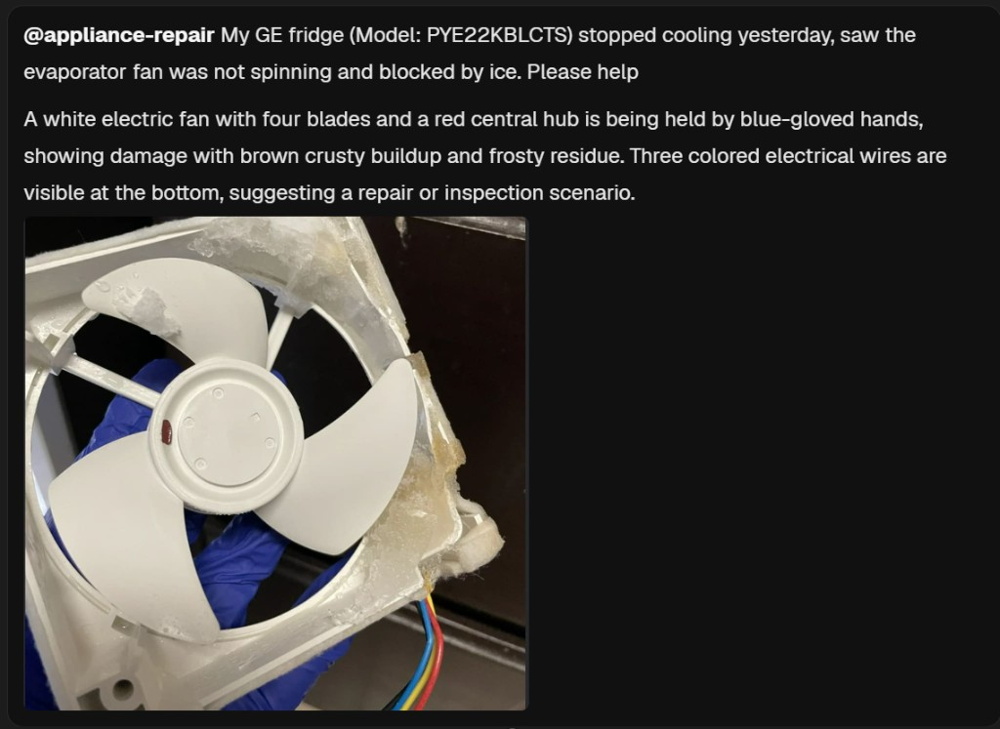
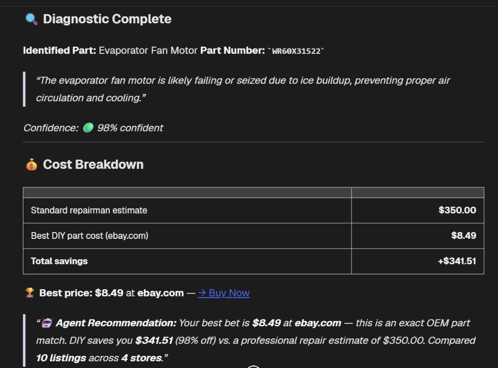
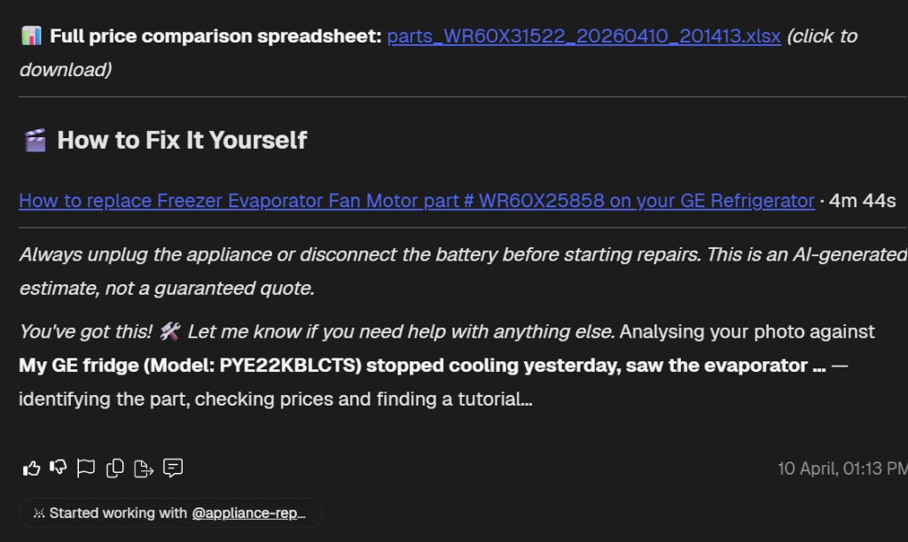

# Appliance Auto Whisperer

`Appliance Auto Whisperer` is a multi-agent repair assistant for ASI:One.
It takes a user photo plus model text, identifies the damaged part, finds live
part prices, and returns a high-confidence DIY repair path with a tutorial link.

- **Category:** `Multi-Agent`, `Vision`, `Agentic Commerce`
- **Difficulty:** Advanced
- **Stack:** uAgents, OpenAI SDK (Gemini-compatible endpoint), Bright Data, YouTube Data API

## What It Does

1. **Orchestrator** receives a chat message (image + context).
2. Vision extraction identifies likely part name/number and confidence.
3. Two workers run in parallel:
   - **Parts Agent** searches pricing across stores.
   - **Tutorial Agent** finds the best repair video.
4. Orchestrator returns a consolidated response:
   - diagnosis
   - cost breakdown and savings
   - best price link
   - repair tutorial

## Screenshots

User prompt + image:



Diagnostic and pricing output:



DIY tutorial and final guidance:



## Project Layout

```text
Appliance Auto Whisperer/
├── diagnostic_bureau.py
├── run.py
├── workers/
│   ├── parts_agent.py
│   └── tutorial_agent.py
├── app/
│   ├── config/
│   ├── services/
│   ├── uagents_protocol/
│   └── utils/
├── docker-compose.yml
├── Dockerfile.bureau
├── render.yaml
├── .env.example
└── requirements.txt
```

## Quick Start

### 1) Install

```bash
python -m venv .venv
source .venv/bin/activate  # Windows: .\.venv\Scripts\Activate.ps1
pip install -r requirements.txt
```

### 2) Configure

```bash
cp .env.example .env  # Windows: copy .env.example .env
```

Set required keys in `.env`:
- `GEMINI_API_KEY`
- `YOUTUBE_API_KEY`
- `BRIGHTDATA_CUSTOMER_ID`
- `BRIGHTDATA_API_TOKEN`
- `BRIGHTDATA_ZONE`
- `AGENTVERSE_API_KEY`
- `ORCHESTRATOR_AGENT_SEED`
- `PARTS_AGENT_SEED`
- `TUTORIAL_AGENT_SEED`

### 3) Run

Option A (recommended):

```bash
python run.py
```

Option B (manual, 3 terminals):

```bash
python workers/parts_agent.py
python workers/tutorial_agent.py
python diagnostic_bureau.py
```

## Docker (Bureau Mode)

```bash
docker compose --profile bureau up --build
```

This starts parts-agent, tutorial-agent, orchestrator, and reports server.

## Notes

- This example is focused on the **uAgents bureau workflow**.
- FastAPI/REST-only scaffolding has been removed to keep the repo clean and aligned with the agent architecture.
