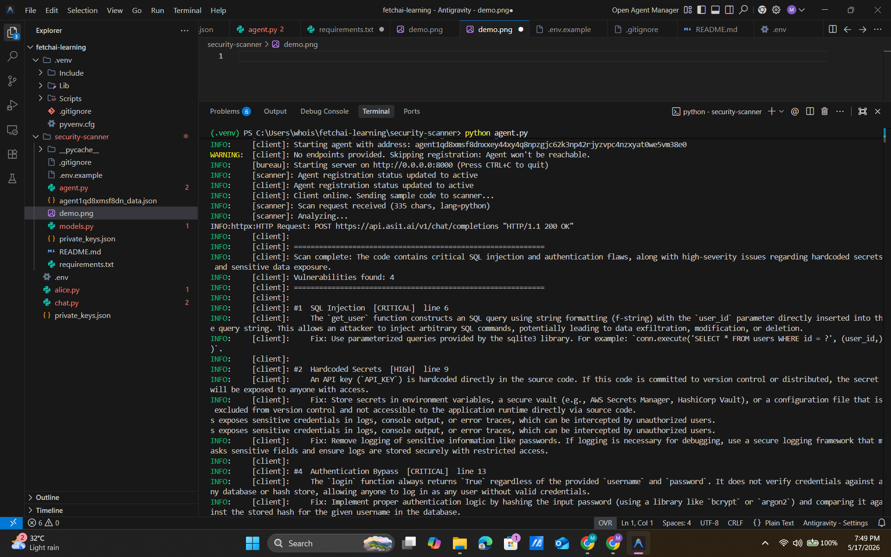

# Security Scanner Agent

A uAgent that performs LLM-powered security analysis on code snippets and returns structured vulnerability reports — type, severity, line number, description, and suggested fix.

## Overview

This example demonstrates an agent-to-agent pattern where a **client agent** sends a code snippet to a **scanner agent**, which uses [ASI:One](https://asi1.ai) (or any OpenAI-compatible LLM) to analyze the code and returns a structured `ScanResponse` with one or more `Vulnerability` findings.

The scanner uses JSON-mode output and a carefully constrained system prompt to produce reliable, machine-parseable security reviews.

## What it detects

The system prompt asks the LLM to look for a broad range of issues, including:

- Injection (SQL, NoSQL, command, LDAP)
- Authentication and session management flaws
- Hardcoded secrets and credentials in logs
- Insecure deserialization (`pickle.loads`, `yaml.load`)
- Use of unsafe functions (`eval`, `exec`, `shell=True`)
- Broken access control / IDOR
- XSS, CSRF
- Insufficient input validation

Each finding includes:

- **Type** — e.g. "SQL Injection", "Hardcoded Secret"
- **Severity** — `low` | `medium` | `high` | `critical`
- **Line number** — when identifiable from context
- **Description** — clear explanation of the issue
- **Suggested fix** — concrete remediation advice

## Tech stack

- [uAgents](https://github.com/fetchai/uAgents) — agent framework
- [ASI:One](https://asi1.ai) — LLM (OpenAI-compatible API)
- [openai](https://github.com/openai/openai-python) — client library
- [python-dotenv](https://github.com/theskumar/python-dotenv) — environment configuration

## Prerequisites

- Python 3.10+
- An [ASI:One API key](https://asi1.ai/dashboard/api-keys) (free credits available)

## Setup

1. Navigate to this example from the repo root:

```bash
   cd security-scanner-agent
```

2. Create a virtual environment and install dependencies:

```bash
   python3 -m venv .venv
   source .venv/bin/activate   # macOS / Linux
   # OR on Windows PowerShell:
   .venv\Scripts\Activate.ps1

   pip install -r requirements.txt
```

3. Configure your API key:

```bash
   cp .env.example .env
   # Edit .env and set ASI_ONE_API_KEY=<your_key>
```

## Running

```bash
python agent.py
```

After both agents come online, the client sends one `ScanRequest` containing a deliberately vulnerable code sample. The scanner analyzes it via ASI:One and returns a structured `ScanResponse`, which the client logs in a readable format.

Press `Ctrl+C` to stop.

## Expected output

After ~10 seconds you'll see (abbreviated):


