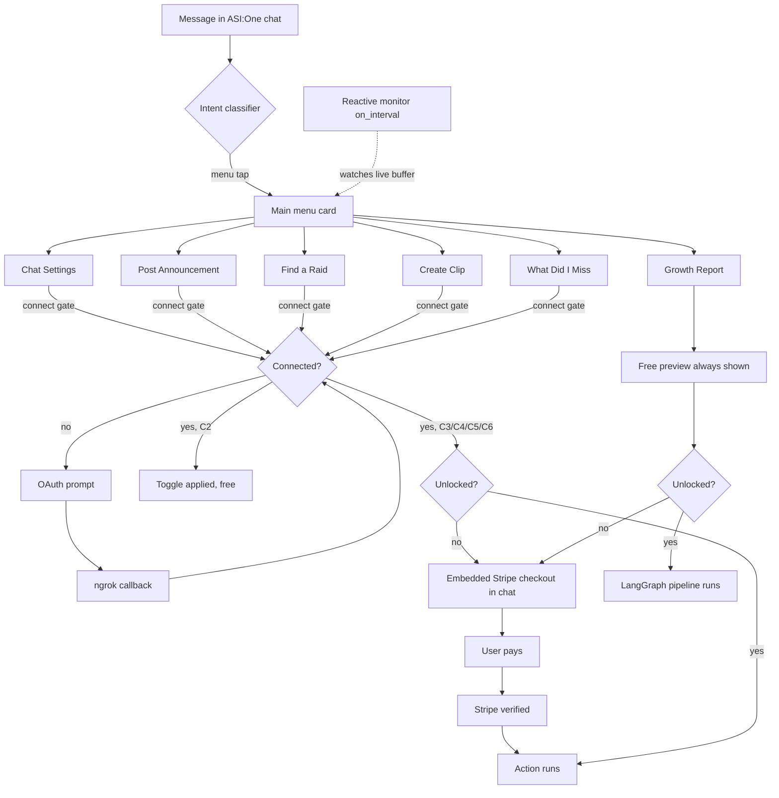

# Twitch Channel Growth Agent

A Twitch assistant uAgent built for the Fetch.ai Innovation Lab (Track 1). It speaks the Chat Protocol, so it is discoverable and interactive on ASI:One and Agentverse. It started as a growth-strategy report tool and has grown into a full menu-driven copilot that can act on a streamer's own channel in real time.

## What it does

A streamer chats with the agent or taps the main menu to access the following features:

| Feature | What it does | Connect required | Unlock required |
|---|---|---|---|
| Growth Report | 5-step LangGraph pipeline: channel analysis, niche detection, competitor benchmarking, gap analysis, and a full growth strategy report | No (uses public Twitch data) | Yes — free preview always shown first |
| Chat Settings | Toggle slow mode, follower-only mode, subscriber-only mode, and emote-only mode on your live channel | Yes | No |
| Post Announcement | Send a colored announcement banner to your Twitch chat | Yes | Yes |
| Find a Raid | Search for a same-category live channel, review the candidate, and start the raid | Yes | Yes |
| Create Clip | Clip the current live stream and return the public and edit URLs | Yes | Yes |
| What Did I Miss | Summarizes chat messages, subs, cheers, raids, and follows that accumulated in the live EventSub buffer, including unanswered questions, highlights, and a Discord draft | Yes | Yes |
| Reactive monitor | Background loop watches the live buffer and proactively offers one confirm-gated action when it detects a moment — spam flood or incoming raid triggers a chat-settings nudge; a big cheer, sub milestone, or new follow triggers an announcement draft | Yes | Implied (user is already connected and unlocked) |
| Connector redirect | Read-only or info queries (follower counts, viewer counts, stream info, title and category changes) are handed off to ASI:One's built-in Twitch connector rather than duplicated here | No | No |

The growth report always shows a free preview (display name and detected niche) before any payment prompt appears. A single one-time Stripe unlock (defaults to $4.99) covers the full growth report and every channel action — it is not charged per feature.

Features marked "connect required" use the streamer's own Twitch token obtained via the Authorization Code OAuth grant. The agent never acts with its own credentials for write operations.

## Architecture



The growth report runs a linear LangGraph graph in `growth_pipeline.py`. A typed shared state (`GrowthState`) is passed through five nodes:

| Node | What it does | Tool |
|---|---|---|
| channel_analyzer | Fetches profile, category, title, and live status | Twitch Helix API |
| content_researcher | Infers the channel's content niche from the stats | ASI:One |
| competitor_benchmarker | Finds leading channels in that niche | Tavily search |
| gap_identifier | Compares the channel to competitors and lists gaps | ASI:One |
| strategy_generator | Synthesizes everything into a growth strategy | ASI:One |

## Files

| File | Purpose |
|---|---|
| `agent.py` | uAgent entrypoint — Chat Protocol, Payment Protocol, menu and card UX, intent classification, all feature handlers |
| `growth_pipeline.py` | Standalone LangGraph growth report pipeline |
| `twitch_oauth.py` | Multi-user Twitch OAuth (Authorization Code grant) plus all channel write operations: chat settings, announcements, raids, clips |
| `oauth_store.py` | Encrypted, SQLite-backed per-user token and OAuth state store |
| `oauth_callback.py` | Raw ASGI app served by uvicorn hosting the OAuth redirect endpoint on port 3000 |
| `eventsub.py` | Persistent Twitch EventSub WebSocket listener per connected user; feeds the recap buffer |
| `recap.py` | Per-user in-memory live event buffer and on-demand recap generation |
| `reactive.py` | Background copilot — watches the buffer on a timer and offers one confirm-gated action when it detects a moderation or celebration moment |
| `health.py` | `/livez` and `/readyz` endpoints for Kubernetes probes and Docker health checks |
| `dispatch_timing.py` | Instrumentation for mailbox and dispatch latency |
| `test_chat_preview.py` | Local Bureau test of the free chat preview (no Almanac or mailbox needed) |
| `restart_agent.sh` | Frees ports 3000 and 8001 and starts `agent.py` using the project venv |
| `Dockerfile` / `docker-compose.yml` | Container build using uv, exposes ports 3000, 8001, and 8080 |
| `pyproject.toml` / `uv.lock` | uv-managed dependencies |
| `k8s/` | Kubernetes manifests (Deployment, Service, PVC, ConfigMap, Secret template) |
| `.env.example` | Annotated template for all required environment variables |

## Setup

### Option A — uv

```bash
uv sync
cp .env.example .env
# fill in your keys
```

### Option B — pip and venv

```bash
python -m venv venv
source venv/bin/activate   # Windows: venv\Scripts\activate
pip install -r requirements.txt
cp .env.example .env
# fill in your keys
```

Required keys in `.env`:

- `ASI_ONE_API_KEY` — ASI:One LLM (https://asi1.ai)
- `TAVILY_API_KEY` — web search for competitor research (https://tavily.com)
- `TWITCH_CLIENT_ID` / `TWITCH_CLIENT_SECRET` — Twitch app credentials (https://dev.twitch.tv/console/apps); register a confidential client with the Authorization Code grant
- `TWITCH_REDIRECT_URI` — must exactly match the redirect URL registered in the Twitch developer console; for local dev point an ngrok HTTPS tunnel at port 3000 and use that URL
- `OAUTH_STATE_SECRET` / `TOKEN_ENCRYPTION_KEY` — random secrets for signing OAuth state tokens and encrypting stored Twitch tokens at rest
- `STRIPE_SECRET_KEY` / `STRIPE_PUBLISHABLE_KEY` — Stripe keys (https://dashboard.stripe.com/apikeys); use `sk_test_` / `pk_test_` keys for testing
- `AGENT_SEED` (optional) — fixed seed phrase for a stable uAgent address across restarts

## Run

### As a uAgent

```bash
./restart_agent.sh
```

This frees ports 3000 and 8001 and starts `agent.py` using the project venv. The agent prints its address on startup. Register that address on Agentverse to make it discoverable from ASI:One.

For local OAuth to work, an ngrok tunnel (or equivalent) must be forwarding HTTPS traffic to `localhost:3000`, and that URL must match `TWITCH_REDIRECT_URI` in `.env` and in your Twitch app's redirect URL list.

#### Test the free preview locally

```bash
python test_chat_preview.py
```

Runs the agent and a test buyer in a single `Bureau` process (no Almanac or mailbox needed) and prints the free preview reply.

### Run the growth pipeline as a script

```bash
python growth_pipeline.py
```

Runs the LangGraph graph on `stableronaldo` and prints the final report. Change `channel_name` in the test block, or import and call the graph directly:

```python
from growth_pipeline import app

result = app.invoke({
    "channel_name": "some_streamer",
    "channel_stats": None, "niche": None,
    "competitors": None, "gaps": None, "final_report": None,
})
print(result["final_report"])
```

### As a container

```bash
docker compose up --build
```

Builds via `Dockerfile` (uv-managed, `uv.lock`-pinned), exposes the OAuth callback (3000), uAgent (8001), and health (8080) ports, and persists the SQLite token store in a named volume. The container reports `healthy` or `unhealthy` via `/readyz`.

### On Kubernetes

```bash
cp k8s/secret.example.yaml k8s/secret.yaml   # fill in real values — gitignored
kubectl apply -k k8s/
```

Liveness and readiness probes hit `/livez` and `/readyz` on the health port. A SIGTERM handler in `agent.py` ensures Kubernetes pod termination runs the uagents shutdown sequence rather than hard-killing the process. The OAuth callback port (3000) needs to be reachable from the public internet for Twitch's redirect to work — wire up an Ingress or LoadBalancer Service using your cluster's conventions; that is deliberately not included since it is cluster-specific.

## Notes and limitations

- The growth report uses a Twitch app access token (client credentials) for public channel stats. Follower and subscriber counts require a user OAuth token with additional scopes, so they are intentionally omitted from that path and sourced from web search instead, labeled as approximate.
- Every Twitch write action (chat settings, announcements, raids, clips) requires the streamer's own token via the Authorization Code grant. The agent never uses its own credentials for write operations.
- The token store is SQLite (`twitchy_tokens.db` by default), encrypted at rest with a NaCl SecretBox. Safe for a single instance; moving to a shared database would be required before running multiple replicas.
- The recap buffer and EventSub listener are in-process memory. Restarting the agent clears them. For the reactive monitor to detect chat activity the EventSub listener must be running, which requires a stored Twitch token and is started automatically on the first message from a connected user.
- The LLM model string is `asi1`. If the API rejects it, switch to `asi1-mini` (see the comment in `growth_pipeline.py`).
- `dispatch_timing.py` is temporary instrumentation for measuring mailbox and dispatch latency; it is slated for removal once baseline numbers are established.
- Never commit `.env` — it contains live keys and is gitignored.
