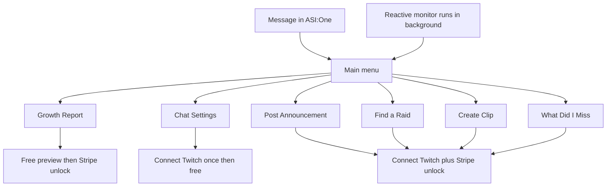

# Twitch Channel Growth Agent

A menu-driven Twitch copilot built on LangGraph and ASI:One. Connect your Twitch account once and the agent can manage your chat settings, post announcements, find raid targets, clip your stream, summarize what happened while you were away, and proactively flag moments worth acting on — all from ASI:One chat without leaving the platform.

## What it does

The agent presents a main menu with six features. Each one is a single conversation flow: the agent asks what it needs, shows a confirm card, and acts on your channel.

**Growth Report** — give it any Twitch channel name and it runs a five-step LangGraph pipeline: channel analysis via the Twitch API, niche detection, competitor benchmarking via Tavily web search, gap analysis, and a full prioritized growth strategy report. A free preview (display name and detected niche) is always shown first. The full report is unlocked with a one-time Stripe payment that happens inside the chat — no leaving ASI:One.

**Chat Settings** — toggle slow mode, follower-only mode, subscriber-only mode, and emote-only mode on your live channel. Reads the current state first and flips each setting. No payment required after connecting.

**Post Announcement** — type a message, pick a color, and the agent posts an announcement banner to your Twitch chat.

**Find a Raid** — enter a category, the agent finds a live channel in that category with a suitable viewer count, shows you a review card with the candidate's name and stats, and starts the raid on your confirmation.

**Create Clip** — one tap clips the current live stream and returns the public URL and edit URL.

**What Did I Miss** — the agent maintains a live buffer of chat messages, subscriptions, cheers, raids, and new follows via an EventSub WebSocket connection. On demand it generates a recap: message count, unanswered questions from chat, highlights and vibe, a list of people to thank (exact names and amounts, not LLM-generated), and a Discord draft the streamer can paste directly.

**Reactive monitor** — runs in the background on a fixed interval and watches the live buffer for moments worth acting on. A burst of chat messages or an incoming raid triggers a single confirm-gated offer to enable slow mode or follower-only mode. A big cheer, a subscriber milestone, or a new follow triggers a drafted announcement offer. The agent only offers one action per moment and respects a cooldown between offers so it stays useful rather than noisy.

**Connector redirect** — read-only queries (follower counts, viewer counts, stream info, title and category lookups) are recognized and handed off to ASI:One's built-in Twitch connector rather than re-implemented here. The agent explains which tool handles those and shows the menu again.

## How to use it

Send the agent any message or tap the main menu. From there every feature is menu-driven — the agent will ask for any input it needs via a form card.

For features that act on your channel (everything except the growth report and connector redirect), you will be asked to connect your Twitch account the first time. The agent sends an OAuth link; you authorize on Twitch, and the connection is stored. You do not need to reconnect unless you explicitly reset access.

The full growth report and all channel actions (announcements, raids, clips, recap) require a one-time unlock. The agent presents an embedded Stripe checkout card in chat. Pay by card in-chat and the unlock persists for all future sessions on that account.

## Architecture

## Tags

`innovationlab` `marketing` `social-media` `twitch` `langgraph` `asi-one` `eventsub` `stripe`
