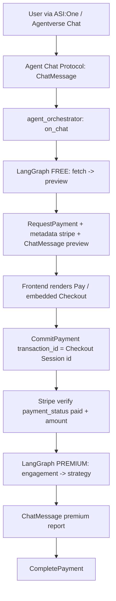

# YouTube Growth Analyzer Agent (`youtube-growth-analyzer-agent`)

A **multi-agent**, **Agentverse-ready** uAgents project that analyzes a YouTube channel from a **URL or channel name**, returns a **small free preview**, requests a **fixed $5.00 USD** payment via **Stripe embedded Checkout** using the **Fetch Agent Payment Protocol (seller role)**, and only then generates the **full premium growth report**.

This repo is structured as an **Innovation Lab**-style example: **Agent Chat Protocol** for ASI:One-style chat, **Agent Payment Protocol** + **Stripe** for monetization, and **LangGraph** to orchestrate distinct analysis agents (not a single prompt-only chatbot).

**Tags / metadata (registration):** `innovationlab`, `youtube`, `stripe`, `langgraph`, `asi1`, `agent-chat-protocol` (see `agent_orchestrator.py` `Agent(..., metadata=...)`).

---

## Real task this agent performs

1. **Resolve** a channel from a pasted **YouTube channel URL** or a **plain channel name** (search).
2. **Fetch** public channel statistics and **recent uploads** via the **YouTube Data API v3**.
3. Run a **multi-step workflow**:
   - **Free:** channel fetch → basic preview agent (lightweight insights only).
   - **Paid:** engagement agent → strategy agent (full report) **only after Stripe payment is verified**.

---

## Why multi-agent (not a one-shot bot)

- **Separation of concerns:** channel resolution + data fetch, lightweight preview, engagement analytics, and long-form strategy are **different responsibilities** with different inputs/outputs.
- **Orchestration visibility:** **LangGraph** makes the pipeline explicit (free graph vs premium graph), which is easier to extend (e.g., swap in an LLM for strategy later) without turning the whole system into one opaque prompt.
- **Safety for monetization:** the **free graph** is intentionally **not** allowed to call premium nodes; premium runs **only** after **payment verification**.

---

## Architecture overview

| Module | Role |
| --- | --- |
| `agent_orchestrator.py` | uAgents entrypoint: **Chat** + **Payment (seller)** protocols, state machine, LangGraph invocations |
| `agent_channel_fetch.py` | Resolve channel + fetch metadata & recent videos (YouTube Data API) |
| `agent_basic_analysis.py` | **Free preview** only |
| `agent_engagement.py` | Paid-tier engagement analytics |
| `agent_strategy.py` | Paid-tier full report synthesis |
| `payment_handler.py` | Stripe **embedded Checkout** session + `RequestPayment` construction + verification |
| `agentverse_mailbox_connect.py` | Optional **POST /connect** so Agentverse creates the mailbox (needed for ASI:One) |
| `models.py` | Pydantic schemas |
| `config.py` | Environment configuration |

### Diagram



---

## Payment UX

1. The user sends a **channel URL** or **name**.
2. The agent returns a **free preview** (basic stats + 1–2 insights) and a clear line: **“Pay $5 to unlock the full growth report.”**
3. The agent emits a seller **`RequestPayment`** with:
   - `accepted_funds=[Funds(currency="USD", amount="5.00", payment_method="stripe")]`
   - `metadata["stripe"]` containing **embedded Checkout** fields (`publishable_key`, `client_secret`, `checkout_session_id`, …).
4. The client shows a **Pay** action / embedded checkout using that payload.
5. After successful payment, the client sends **`CommitPayment`** with `transaction_id` set to the **Stripe Checkout Session id**.
6. The agent **verifies** the session with Stripe, sends **`CompletePayment`**, then returns the **premium report**.
7. If verification fails, **premium content is not returned**.

---

## How this maps to the Stripe Horoscope Agent example

This project follows the same **Innovation Lab** integration pattern documented for [**Stripe Horoscope Payment Protocol**](https://innovationlab.fetch.ai/resources/docs/examples/agent-transaction/stripe-horoscope-payment-protocol):

| Horoscope example concept | This repo |
| --- | --- |
| Seller `AgentPaymentProtocol` | `build_payment_proto(..., role="seller")` in `agent_orchestrator.py` |
| `create_embedded_checkout_session(..., ui_mode="embedded")` | `payment_handler.py` |
| `RequestPayment.metadata["stripe"] = checkout` | `build_request_payment(...)` |
| `CommitPayment.transaction_id = Checkout Session id` | `on_commit` in `agent_orchestrator.py` |
| `verify_checkout_session_paid` | `payment_handler.verify_checkout_session_paid` (+ amount check) |
| `CompletePayment` before paid content | `on_commit` sends `CompletePayment` before premium `ChatMessage` |

**Stripe API keys:** configure **publishable** + **secret** keys as described in [Stripe: API keys](https://docs.stripe.com/keys?locale=en-GB).

---

## Setup

**Requirements**

- **Python 3.10+** (3.12 recommended). `uagents_core.contrib.protocols` (chat + payment models) requires **3.10+** on PyPI.
- YouTube Data API key with **YouTube Data API v3** enabled.
- Stripe **test** keys for safe demos (`sk_test_...`, `pk_test_...`).

```bash
cd youtube-growth-analyzer-agent
python3.12 -m venv .venv
source .venv/bin/activate   # Windows: .venv\Scripts\activate
pip install -r requirements.txt
cp .env.example .env
# edit .env
```

### Environment variables (`.env`)

| Variable | Purpose |
| --- | --- |
| `YOUTUBE_API_KEY` | YouTube Data API v3 key |
| `STRIPE_SECRET_KEY` | Stripe secret key ([docs](https://docs.stripe.com/keys)) |
| `STRIPE_PUBLISHABLE_KEY` | Stripe publishable key |
| `STRIPE_SUCCESS_URL` | Embedded Checkout `return_url` base (Stripe appends `session_id`) |
| `STRIPE_CURRENCY` | e.g. `usd` (lowercase) |
| `AGENT_PORT` | Local agent port (default `8012`) |
| `AGENTVERSE_API_TOKEN` | **Strongly recommended for ASI:One** — Agentverse profile API token (auto `/connect`) |
| `MAILBOX_CONNECT_DELAY_SECONDS` | Seconds to wait before first `/connect` (default `15`) |
| `MAILBOX_CONNECT_RETRIES` | Retries if `/connect` fails (default `6`) |
| `USE_MAILBOX` | `true` for Agentverse mailbox delivery; `false` for local-only experiments |
| `LOG_MAILBOX_HELP` | `true`/`false` — short mailbox reminder on startup (default `true`; use `false` to reduce log noise in production) |
| `AGENT_SEED` | **Same value** for local, Docker, and deployment so the **agent address** is stable (mailbox / ASI:One) |

See `.env.example` for optional tuning keys.

### Production checklist

- **Secrets:** inject `YOUTUBE_API_KEY`, `STRIPE_*`, and `AGENTVERSE_API_TOKEN` via your platform (Kubernetes secrets, etc.); never commit `.env`.
- **Identity:** set a strong, unique **`AGENT_SEED`** so the agent address is stable and not guessable.
- **Stripe:** use **live** keys and a real **`STRIPE_SUCCESS_URL`** allowed in your [Stripe Dashboard](https://dashboard.stripe.com/) for embedded Checkout.
- **Logging:** set **`LOG_LEVEL=INFO`** (or `WARNING`) and **`LOG_MAILBOX_HELP=false`** once mailbox setup is documented for your ops team.
- **Install:** `pip install -r requirements.txt` (versions are pinned for reproducible builds).
- **Docker:** build with `docker compose build`; inject the **same** `AGENT_SEED` and secrets as non-container runs so the published address does not change.

---

## How to run locally

```bash
source .venv/bin/activate
set -a; source .env; set +a
python agent_orchestrator.py
```

If the terminal shows **no log lines**, run unbuffered: `python -u agent_orchestrator.py` (or `PYTHONUNBUFFERED=1`).

Watch logs for the **Agent inspector** URL (useful for quick protocol testing).

**Health check** (while the agent is running): `curl -s http://127.0.0.1:8012/agent_info` (adjust port if needed).

---

## Run with Docker (same seed as local)

Use the **same** `.env` (or at least the same **`AGENT_SEED`**, **`AGENTVERSE_API_TOKEN`**, **`AGENT_PORT`**, and API keys) when you run locally and in Docker so the **agent address** and **mailbox** stay aligned with Agentverse / ASI:One.

```bash
cd youtube-growth-analyzer-agent
cp .env.example .env   # if needed
# edit .env — set AGENT_SEED, YOUTUBE_API_KEY, STRIPE_*, AGENTVERSE_API_TOKEN, etc.

docker compose up --build
```

- **Port:** default **`8012`** on the host (`AGENT_PORT` in `.env` must match the mapped port).
- **Health:** `curl -s http://127.0.0.1:8012/agent_info` (or your `AGENT_PORT`).
- **Mailbox:** `AGENTVERSE_API_TOKEN` in `.env` is passed into the container; the background `/connect` still targets **`127.0.0.1:<AGENT_PORT>`** inside the container (correct for the running process).
- **Inspector URL in logs:** use the **host** port you published (e.g. `8012`), not a different port.

Pattern aligned with [nexus-socal](https://github.com/rajashekarcs2023/nexus-socal) (Dockerfile + compose + env file).

### Docker troubleshooting

| Symptom | What to do |
| --- | --- |
| `zsh: command not found: docker` | Install [Docker Desktop for Mac](https://www.docker.com/products/docker-desktop/) (or `brew install --cask docker`), open the app once so the daemon starts, then retry `docker compose up --build`. |
| `Failed to connect ... agentverse.ai ... [nodename nor servname provided]` | The container could not resolve DNS. `docker-compose.yml` sets public DNS (`8.8.8.8`); ensure the host has internet. If your network blocks Google DNS, remove the `dns:` block and fix Docker Desktop → Settings → Network / DNS. |
| `401` / `Could not validate credentials` (mailbox) | Regenerate or copy a fresh **`AGENTVERSE_API_TOKEN`** from your Agentverse profile into `.env` and restart. |

---

## Register on Agentverse

High level (details change with Agentverse UI versions):

1. Ensure your agent can be reached (often **`USE_MAILBOX=true`** so Agentverse can deliver messages to your agent).
2. Run the agent and confirm manifests publish successfully (`AgentChatProtocol`, `AgentPaymentProtocol`).
3. Register/publish the agent in Agentverse using your project’s standard flow (Almanac registration happens via uAgents when configured).

Use **metadata tags** like `innovationlab` (already included in `Agent.metadata`) to make the agent easy to find in internal listings.

---

## Invoke from ASI:One (discoverability)

- This agent advertises the **Agent Chat Protocol** manifest (`publish_manifest=True` on the chat protocol).
- ASI:One / compatible clients discover agents by supported protocols; users can start a chat session and send a **channel URL** or **name** as plain text.

**Chat protocol entrypoint:** inbound messages are handled in `on_chat` inside `agent_orchestrator.py` (see `build_chat_proto`).

### If ASI:One shows no reply (most common: mailbox not registered)

Remote clients (including ASI:One) send messages to your agent’s **mailbox on Agentverse**. The local process **polls** that mailbox. If the mailbox was never created, uAgents logs **`Agent mailbox not found: create one using the agent inspector`** and you will get **silence** in chat.

**Fastest fix — set `AGENTVERSE_API_TOKEN` in `.env`**

1. In [Agentverse](https://agentverse.ai/), open your profile and copy your **API token** (same token used in Inspector → Connect).
2. Add to `.env`: `AGENTVERSE_API_TOKEN=...`
3. Restart the agent. After ~8 seconds it will **POST `/connect` automatically** (same as Inspector → Mailbox). Confirm logs show **`Successfully registered as mailbox agent in Agentverse`**.

**Manual alternative (no token in `.env`)**

1. **`USE_MAILBOX=true`** in `.env` (default).
2. Start **`python agent_orchestrator.py`** and keep it running.
3. Open the **Local Agent Inspector** link from the terminal (`https://agentverse.ai/inspect/?uri=...&address=...`).
4. Click **Connect** → **Mailbox** → paste your **Agentverse API token**.
5. **Chrome / Brave:** allow **Local network access** for `agentverse.ai` ([Chrome note](https://developer.chrome.com/blog/local-network-access)).

Then in ASI:One, use the **same agent address** as in the logs and send a **YouTube channel URL or name**.

See [Agent Mailboxes](https://uagents.fetch.ai/docs/agentverse/mailbox).

---

## Testing the Stripe payment flow

1. Use **Stripe test mode** keys in `.env`.
2. Start the agent and open a compatible chat client / Agent inspector.
3. Send a channel URL.
4. Complete checkout with Stripe test card **`4242 4242 4242 4242`** (see [Stripe testing](https://docs.stripe.com/testing)).
5. Confirm the client sends **`CommitPayment`** with the **Checkout Session id** as `transaction_id`.
6. Verify logs show **`CompletePayment`** then the **premium** markdown report.

---

## Example chat input

```
https://www.youtube.com/@GoogleDevelopers
```

or

```
Google Developers
```

---

## Example outputs (shape)

**Free preview:** channel name, subscriber count (if public), upload cadence summary, 1–2 insights, and a line asking to pay $5 for the full report.

**Premium (after payment):** sections for overview, performance, engagement, content patterns, top-performing patterns, weaknesses, seven recommendations, content pillars, posting cadence, and a final strategy summary (may arrive as **multiple chat messages** if long).

---

## Known limitations

- **YouTube API quota & access:** searches and video stats consume quota; some channels hide subscriber counts or disable comments/likes on some videos.
- **Deterministic strategy text:** the premium report is **rules/template-driven** for demo reliability (you can plug an LLM into `agent_strategy.py` later without changing the payment gate).
- **Payment UX depends on the client:** the agent provides **`RequestPayment` + `metadata["stripe"]`**; the UI must render embedded Checkout.
- **Long premium reports:** chat clients often **truncate a single message**. The agent **splits** the paid report into multiple **`ChatMessage`** parts (see `PREMIUM_REPORT_CHUNK_CHARS`, default 4000). Scroll for **“Premium report continued 2/N”** if you do not see everything in the first bubble.
- **Session timeout:** if you pay **after** `STATE_TTL_SECONDS` (default 2 hours) from the free preview, stored channel data may be cleared and the premium step cannot run — run a **new analysis** and pay within the window.

---

## How this satisfies Fetch Internship **Track 1** expectations (mapping)

- **uAgents / Agentverse-compatible structure** with explicit **protocol manifests**.
- **Agent Chat Protocol** for user-facing chat and discoverability.
- **Agent Payment Protocol (seller)** with **Stripe embedded Checkout** metadata.
- **Clear paid vs free boundary:** free preview first; **verification** before premium content.
- **Multi-agent workflow** orchestrated with **LangGraph**, not a single monolithic prompt.
- **Innovation Lab alignment:** `innovationlab` tag + documented mapping to the **Stripe Horoscope** reference pattern.

---

## Project layout

```
youtube-growth-analyzer-agent/
  agent_orchestrator.py
  agentverse_mailbox_connect.py
  agent_channel_fetch.py
  agent_basic_analysis.py
  agent_engagement.py
  agent_strategy.py
  payment_handler.py
  models.py
  config.py
  requirements.txt
  Dockerfile
  docker-compose.yml
  .dockerignore
  .env.example
  README.md
  .gitignore
```

---

## License

Example code for educational / Innovation Lab-style demonstration. Ensure you comply with **YouTube** and **Stripe** terms for your deployment.
